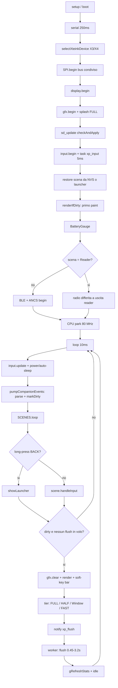

# Architettura del firmware Flowe OS

Modulo firmware: `xphone-os/` (PlatformIO + Arduino-ESP32, ESP32-C3, 320 KB RAM interna, no PSRAM); SDK
hardware vendorizzato in `freeink-sdk/libs/` (symlink in `platformio.ini:83-90`). Un solo binario
universale serve X3 (UC8253 792x528) e X4 (SSD1677 800x480): `platformio.ini:1-8`.
Capitoli collegati: [BLE](03-protocollo-ble.md), [app/schermate](04-app-e-schermate.md), [reader](05-reader-epub.md), [hardware/power/OTA](06-hardware-power-ota.md), [build/fork](07-build-ci-e-fork.md).

## Boot

`setup()` è solo `boot()` (`src/main.cpp:321`). Nessun oggetto dinamico: display, `Gfx`, `Input` sono
globali statici (`main.cpp:51-56`), tutte le scene sono istanze statiche (`Scene.h:11`).

| Stage | Righe | Azione | Note |
|---|---|---|---|
| 0 | `main.cpp:147-150` | `millis()` di riferimento + `esp_reset_reason()` | etichetta wake (POWERON/DEEPSLEEP/…, `main.cpp:131-144`), mostrata in About |
| 1 | `main.cpp:156-158` | `delay(250)`, `Serial.begin(115200)`, `setTxTimeoutMs(1)` | il delay serve all'enumerazione USB-CDC; TX timeout 1 ms per non bloccare senza host |
| 2 | `main.cpp:166-170` | `freeink::selectXteinkDevice()` → `display.setDisplayX3()` | fingerprint I2C delle parti solo-X3 (gauge/RTC/IMU), `XteinkDetect.cpp:129-132`; imposta `BoardConfig::ACTIVE` |
| 2.1 | `main.cpp:179-192` | `SPI.begin(sclk, sd.miso, mosi, cs)`, poi probe `/boot-trace.txt` | bus display+SD inizializzato UNA volta con MISO (`SPIClass::begin` è first-call-wins: senza MISO la SD resta illeggibile). Se il file trace esiste, ogni stage appende `"%8lu ms  %s\n"` (`main.cpp:116-125`) |
| 2.3 | `main.cpp:194-211` | `display.begin()`, poi `gfx.begin()` + `drawBootSplash()` | il driver pannello azzera il framebuffer a `0xFF`; lo splash fa un `FULL_REFRESH` sincrono (`main.cpp:86-97`) così il primo dei due lampi di condizionamento porta contenuto |
| 2.5 | `main.cpp:217` | `sd_update::checkAndApply(display)` | self-update da `/update.bin`; deliberatamente prima di tutto il resto (vedi [cap. 06](06-hardware-power-ota.md)) |
| 3 | `main.cpp:223-226` | `input.begin()` + `input.beginTask()` | ladder ADC + task di sampling a 5 ms |
| 4 | `main.cpp:243-263` | `seedPersistedBlock()`, `consumeRestoreScene()` → `showSceneById()`/`showLauncher()`, `SCENES.renderIfDirty(gfx)`, `gBootTotalMs` | primo paint reale (scena da NVS, chiave consumata al boot) + riga `stages ms: serial=… display=… splash=… sdupdate=… launcher=… total=…` e report heap |
| 4.5 | `main.cpp:271` | `BatteryGauge::ensureDesignCapacity()` | dopo il primo paint (la riprogrammazione BQ27220 costa secondi), prima della radio per non sovrapporre I2C e BLE |
| 5 | `main.cpp:300-307` | `COMPANION_BLE.begin()`, `COMPANION_ANCS.begin()`, `requestPairing()` | "UI prima, radio dopo"; **saltato** se la scena ripristinata è `Reader` (l'heap è già occupato dal libro: BLE init in quell'heap ha bloccato il boot) |
| 6 | `main.cpp:314-318` | `setCpuFrequencyMhz(XP_CPU_MHZ)` (default 80) | dopo il bring-up BLE, così lo stack non si inizializza a cavallo di un cambio di frequenza; `-DXP_CPU_MHZ=160` rende lo stage un no-op (`CpuBoost.h:5-11`) |

Rilevamento device: **runtime**, non compile-time. Ogni env definisce sia `FREEINK_DEVICE_X3` sia
`FREEINK_DEVICE_X4` (`platformio.ini:99-100,114-115,123-124`), `DEFAULT_DEVICE` parte come `XTEINK_X4`
e `selectDevice()` scambia il profilo (`BoardConfig.h:889-912`); `gDeviceIsX3` (`DeviceKind.h:8`) è la
globale letta dalle scene. Se `gfx.begin()` fallisce, `boot()` logga `FATAL: no framebuffer` e ritorna
senza launcher né radio (`main.cpp:231-234`) — ma `loop()` continua a girare (vedi attriti).
Boot-to-first-paint: misurato in `gBootTotalMs` (`AppScenes.cpp:14`), mostrato da About
(`AboutScene.cpp:43`); nel repo **non è presente nessun valore misurato** di riferimento.

## Task e concorrenza

`loop()` (`main.cpp:644-653`) è una sequenza fissa senza allocazioni: `input.update()` →
`checkPowerButton()` → `checkAutoSleep()` → `pumpCompanionEvents()` → `COMPANION_BLE.tickAdvPolicy()`
→ `SCENES.loop(input, gfx)` → `reportRuntimeStats()` → `delay(10)`. Nessun redraw periodico.

| Task | Creazione | Stack | Prio | Periodo/trigger |
|---|---|---|---|---|
| `loopTask` (Arduino) | framework | 8192 B (valore dichiarato in `main.cpp:612-613`, non verificato nel core) | 1 | `delay(10)` |
| `xp_input` | `xTaskCreate` (heap), `Input.h:60` | 2560 B | 2 | `vTaskDelayUntil` 5 ms (`Input.h:120-126`) |
| `xp_flush` | `xTaskCreateStatic` (stack+TCB in BSS), `Scene.cpp:234-236` | 4096 B | 1 | `ulTaskNotifyTake(portMAX_DELAY)` |
| `nimble_host` | core precompilato | 5120 B (dichiarato in `main.cpp:613`) | — | eventi radio |

Regole di thread-safety, tutte esplicite nel codice:

- I callback BLE/ANCS girano su `nimble_host` e **solo accodano**: `handleCardWrite` copia e alza un
  flag (`CompanionBleService.cpp:673-677`), le notifiche ANCS finiscono in due code statiche
  (`CompanionAncsClient.cpp:507-512`); il parse JSON su quello stack causò uno stack protection fault
  in x4-os (`CompanionBleService.h:14-17`).
- Drenaggio e **tutti** i `markDirty()` da eventi radio stanno solo in `pumpCompanionEvents()`, e solo
  se la scena colpita è a schermo (`main.cpp:365-370`, `:432-490`).
- Gli store sono main-loop-only per costruzione, quindi senza mutex (`NotificationStore.h:6-12`).
- Il loop tocca il framebuffer solo se nessun flush è in volo (`Scene.cpp:159-163`); pilotare il
  pannello fuori dal worker richiede `SCENES.waitFlushIdle()` (`Scene.h:122-124`; call-site
  `Sleep.cpp:203`, `main.cpp:549`, `FileTransferScene.cpp:92`).
- `Input` pubblica snapshot volatile single-word e latch protetti da `portMUX` (`Input.h:153-180`).

Code (dimensioni calcolate): `packetQueue` ANCS Data Source, depth 6 × `AncsPacket` 520 B
(`uint16 len` + `uint32 sessionId` + `uint8 data[512]`) = 3.120 B; `nsQueue` Notification Source,
depth 48 × `AncsNsPacket` 16 B = 768 B — entrambe statiche (`CompanionAncsClient.cpp:38-56,71-74`).

Il worker di flush non usa code: un solo flush in volo, parametri in `_flushReq`/`_flushRect` scritti
dal loop prima di `xTaskNotifyGive` (`Scene.cpp:239-244`); `waitFlushIdle()` è
`while (_flushInFlight) delay(2)` (`Scene.cpp:246-248`). `reportRuntimeStats()` stampa ogni 60 s HWM
stack loop/nimble, heap free, largest block, frammentazione %, high-water e drop ANCS
(`main.cpp:617-642`).

## Scene manager

Interfaccia `Scene` (`Scene.h:16-82`), firme complete:

```cpp
virtual void onEnter() {}                              // :23
virtual void onExit() {}                               // :24
virtual const char* const* softKeys() const;           // :31  4 label statiche, nullptr = tab nascosto
virtual uint8_t longPressSlots() const { return 0x01; }// :37  bit i = slot con long-press
virtual uint8_t softKeyIconMask() const { return 0; }  // :41  bit i = tab a icona (gear), metà larghezza
virtual void handleInput(Input& in) = 0;               // :46  reagisce agli edge, non disegna mai
virtual void render(Gfx& gfx) = 0;                     // :48  compone TUTTO il frame (fb già bianco)
```

Dirty-flag con scoping per-scena (`Scene.h:50-73`): `markDirty()` = full-panel;
`markDirty(const XpRect&)` accumula per unione in `_dirtyRect`, un rect vuoto forza full-panel; stato
iniziale `_dirty = _dirtyAll = true`, quindi il primo paint è completo (`Scene.h:79-80`). Le scene
compongono comunque il frame intero: il rect restringe solo la finestra di refresh (`Scene.cpp:176-178`).
`switchTo(Scene&)` (`Scene.cpp:127-134`): no-op se già attiva, poi `onExit()` → `_active = &s` →
`_needFull = true` → `markDirty()` → `onEnter()`; nessuno stack di scene, nessun heap.
`SceneManager::loop()` (`Scene.cpp:109-122`): il long-press `Back` è consumato qui e porta al launcher
da qualunque scena, altrimenti l'input va alla scena; poi `renderIfDirty()`.

Politica di refresh (`Scene.cpp:157-216`):

| Tier | Condizione | Costo dichiarato nei commenti |
|---|---|---|
| `FULL` | `_needFull` e `_bootFlushes < 2` (condizionamento pannello X3) | ~3,2 s (`Scene.cpp:188-190`) |
| `HALF` | `_sinceScrub >= kScrubAfterRefreshes` (10, `Scene.h:99`) | scrub anti-ghosting periodico, cadenza da CrossPoint |
| `Window` (PARTIAL) | rect valido, non `_needFull`, condizionamento fatto, area ≤ 50% del pannello (`kPartialMaxAreaPct`, `Scene.cpp:149`) | finestra nativa del driver |
| `FAST` | tutto il resto, **inclusi i cambi di scena** dopo il condizionamento | ~450 ms |

Statistiche dell'ultimo flush (`drawMs`, `refreshMs`, `tier`, `sinceScrub`) in `gRefreshStats` (`Scene.h:88-94`), mostrate da About; il worker stampa `draw=…ms refresh=…ms tier=… sinceScrub=… rect=x,y wxh` (`Scene.cpp:285-287`).

Barra soft-key: `Scene::SOFTKEY_BAR_H = 44` px logici riservati in fondo a ogni scena (`Scene.h:21`),
tab visibile alto `kTabH = 28`, raggio 10, margine 8% per lato, gap 10 (`Scene.cpp:22-29`) → su X3
`marginX = 42` e `tabW = (528 - 84 - 30) / 4 = 103`, su X4 `38` e `93` (`Scene.cpp:56-68`). Il tab
icona è metà larghezza allineato a destra; un pallino da 3 px sul bordo alto marca gli slot con
long-press (`Scene.cpp:91-94`). La barra è ridisegnata dal manager dopo ogni `render()`
(`Scene.cpp:181`), quindi non genera traffico e-ink extra.

Mapping slot → pulsante fisico: 0 = Back, 1 = Confirm, 2 = Left, 3 = Right (`Scene.h:26-29`).

| Scena | Vista/stato | Slot 0 | Slot 1 | Slot 2 | Slot 3 | Evidenza |
|---|---|---|---|---|---|---|
| default (`Scene`) | — | BACK | — | — | — | `Scene.cpp:11-14` |
| Launcher | — | gear (icona, `softKeyIconMask()=0x01`) | OPEN | PREV | NEXT | `LauncherScene.cpp:148-151`, `LauncherScene.h:14` |
| Block | Main, non attivo | BACK | START | MODE | — | `BlockScene.cpp:175` |
| Block | Main, attivo | BACK | — | BREAK | — | `BlockScene.cpp:179` |
| Block | lista preset | BACK | SELECT | UP | DOWN | `BlockScene.cpp:180` |
| Notifications | lista, riga selezionata | BACK | OPEN | UP | DOWN | `NotificationsScene.cpp:68` |
| Notifications | lista, pill SYNC (`_sel < 0`) | BACK | SYNC | UP/— | DOWN/— | `NotificationsScene.cpp:69-70,73` |
| Notifications | dettaglio | BACK | CLEAR | PREV | NEXT | `NotificationsScene.cpp:71` |
| Priorities | lista piena / vuota | BACK | DONE / SYNC | UP / — | DOWN / — | `PrioritiesScene.cpp:140-142` |
| Today | con / senza snapshot | BACK | SYNC | UP / — | DOWN / — | `TodayScene.cpp:164-166` |
| Workout | lista piena / vuota | BACK | +SET / SYNC | UP / — | DOWN / — | `WorkoutScene.cpp:101-103` |
| Reader | Reading | BOOKS | SIZE | PREV | NEXT | `ReaderScene.cpp:265` |
| Reader | BookList (con/senza libri) | BACK | OPEN / — | UP / — | DOWN / — | `ReaderScene.cpp:266-272` |
| Reader | Opening/Indexing | — | — | — | — | `ReaderScene.cpp:263,275-278` |
| Settings | lista | BACK | OPEN | UP | DOWN | `SettingsScene.cpp:95` |
| Settings | conferma flash/restart | NO | YES | — | — | `SettingsScene.cpp:96` |
| Settings | icon style | BACK | — | PREV | NEXT | `SettingsScene.cpp:97` |
| FileTransfer | Idle (con/senza credenziali) | BACK | SYNC / — | — | — | `FileTransferScene.cpp:60-61,66` |
| FileTransfer | Connecting / Running / Failed | CANCEL / EXIT / BACK | — / — / RETRY | — | — | `FileTransferScene.cpp:62-64` |

Long-press dichiarati: solo `NotificationsScene` aggiunge il bit 1 (clear-all su CONFIRM) a lista non vuota (`NotificationsScene.cpp:77-83`); le altre restano a `0x01`.

## Layer grafico

Framebuffer: **single buffer**, statico in BSS dentro l'oggetto `EInkDisplay`
(`FreeInkDisplay.h:145-158`, `-DEINK_DISPLAY_SINGLE_BUFFER_MODE=1` in `platformio.ini:42`), grande
`MAX_FRAMEBUFFER_BYTES` = massimo fra i pannelli compilati (`BoardConfig.h:864-871`): con X3+X4
attivi **52.272 B** (792/8 × 528); X4 da solo sarebbero 48.000 B. `clear()` è un `memset(0xFF)`
sull'intero buffer (`FreeInkDisplay.cpp:182`); bit azzerato = nero (`Gfx.h:22-23`).

Rotazione logica: si disegna in **portrait logico** (X3 528x792, X4 480x800). `Gfx::begin()` scambia
le dimensioni (`_w = getDisplayHeight()`, `_h = getDisplayWidth()`, `Gfx.cpp:6-14`) e `drawPixel()` è
l'unico punto di trasformazione: `phyX = y`, `phyY = _w - 1 - x`, 90° CW come il
`GfxRenderer::Portrait` di CrossPoint (`Gfx.cpp:16-32`). Poiché una colonna logica è una riga nativa,
`fillRect` diventa head-mask + `memset` + tail-mask (5-15x meno CPU, `Gfx.cpp:67-105`) e `blitGlyph`
coalesce fino a 8 pixel di glifo per read-modify-write (`Gfx.cpp:198-237`).

Primitive `Gfx` (`Gfx.h:59-124`), firme complete:

```cpp
bool begin();  int width() const;  int height() const;  EInkDisplay& display();  void clear();
void drawPixel(int x, int y, bool black);
void drawLine(int x0, int y0, int x1, int y1, int thickness, bool black);
void fillRect(int x, int y, int w, int h, bool black);
void drawRect(int x, int y, int w, int h, int thickness, bool black);
void fillRoundedRect(int x, int y, int w, int h, int r, bool black);
void drawRoundedRect(int x, int y, int w, int h, int r, int thickness, bool black);
int  textWidth(const XpFont& f, const char* text) const;   int lineHeight(const XpFont& f) const;
void drawText(const XpFont& f, int x, int y, const char* text, bool black = true);
void drawTextCentered(const XpFont& f, int cx, int y, const char* text, bool black = true);
int  drawTextWrapped(const XpFont& f, int x, int y, const char* text, int maxWidth, int maxLines, bool black = true);
void flush(EInkDisplay::RefreshMode mode);                 // FULL / HALF / FAST
Gfx::FlushTier flushWindow(int x, int y, int w, int h);     void flushWindowFlash(int x, int y, int w, int h);
```

`flushWindow()` (`Gfx.cpp:354-399`) clampa il rect logico, lo mappa in nativo e allarga la X nativa a
multipli di 8 (PTL UC8253 ha risoluzione orizzontale 8 px; SSD1677 rifiuta silenziosamente
`x%8 != 0`); finestra degenere → fallback `FAST_REFRESH` full-panel.

Font: formato `EpdFontData` di epdiy vendorizzato in `lib/EpdFontCore/EpdFontData.h` (`EpdGlyph` =
width, height, `advanceX` 12.4 fixed-point, left, top, dataLength, dataOffset; bitmap 1bpp MSB-first,
`pixelPosition = glyphY*width + glyphX`). `XpFont` (`Gfx.h:50-57`) referenzia solo
bitmap/glyph/interval, così matrici kern (~24 KB/font) e ligature restano fuori dal binario; kerning e
ligature non sono implementati, glifo mancante → `'?'` (`Gfx.cpp:245,257`).

| Font | Uso | advanceY / ascender | Bitmap | Glifi | Flash totale (calcolato) |
|---|---|---|---|---|---|
| `kFontSmall` = ubuntu_10 regular | label soft-key | 24 / 20 (`Fonts.cpp:45-46`) | 6.666 B | 319 | 11.806 B |
| `kFontRegular` = ubuntu_12 regular | testo UI | 29 / 24 (`Fonts.cpp:25-26`) | 9.193 B | 319 | 14.333 B |
| `kFontBold` = ubuntu_12 bold | titoli | 29 / 24 (`Fonts.cpp:34-35`) | 10.112 B | 319 | 15.252 B |

Totale stack testo ≈ **41.391 B** di flash (bitmap + 319 × 16 B di `EpdGlyph` + 3 intervalli × 12 B per
font). Copertura reale: U+0020–U+007E, U+00A0–U+00FF, U+0100–U+017F (`fonts/ubuntu_10_regular_ascii.h:1-2`
e tabella `Intervals`), cioè Latin-1 + Latin Extended-A. `Fonts.cpp` è l'unica TU con i dati (`Fonts.h:4-6`).

Bitmap e icone (formato comune: 1bpp, MSB-first, bit 0 = inchiostro, righe allineate al byte):

| Asset | Dimensioni | Byte compilati | Evidenza |
|---|---|---|---|
| `FloweLogoBitmap` (splash) | 120x120 | 1.800 | `art/FloweLogo.h:9-12` |
| `XPhoneIcon_*` launcher | 104x104, 5 pack × 6 app | 40.560 (1.352/icona) | `art/LauncherIcons.h:9-11` |
| `BlockHeroField` / `BlockHeroWork` X3 | 480x330 / 340x340 | 19.800 + 14.620 | `art/BlockArtwork.h:20-24,1073-1075` |
| `BlockIcon*` (target/book/moon) | 48x48 | 3 × 288 | `art/BlockArtwork.h:3308-3346` |

Il pack di icone attivo è persistito in NVS (namespace `xphone`, chiave `iconPack`, `uint8`,
`IconStyle.cpp:9-10,44-51`); `iconForApp()` indicizza `XPhoneIconPacks[pack][app]` nell'ordine Today,
Notifications, Priorities, Block, Read, Workout, lo stesso di `kApps` (`LauncherScene.cpp:22-24`).

Status bar (`StatusBar.h:40-113`): cluster a destra `[pct%] gap 4 [icona 15x12 + nub 1px]`,
riempimento proporzionale (`maxFill = 10`, `fillH = 8`, `+1` per garantire ≥1 px), fulmine bianco
invertito in carica con fill minimo 8 px, `--%` se la carica è ignota. A sinistra della percentuale il
**sync dot** 5x5: presente solo se `xphoneSyncActive()`, pieno se `xphoneSyncBusy()`, vuoto in attesa
(`StatusBar.h:101-111`; predicati `main.cpp:354-363`). Nessun refresh periodico: cambia sui repaint che
il sync già provoca, più un repaint one-shot sul fronte attivo↔idle (`main.cpp:513-525`).

Sync indicator (`SyncIndicator.h`): frecce up/down negli header di Block/Workout/Priorities.
`classify()` deduce la direzione dal suffisso del messaggio BLE (`" sent"` → Up, `" received"` → Down);
la freccia attiva resta bold (tratto 3 px) per `kBoldMs = 1000` ms, poi torna a 1 px
(`SyncIndicator.h:30-45,87-96`); `tick()` copia la stringa solo quando la revision cambia.

## Input

`Input` (`Input.h`) è un wrapper sul `InputManager` dell'SDK. Mapping logico→fisico fisso, nessun
sistema di impostazioni (`Input.h:113-116`):

| Logico (`Btn`) | Indice SDK | Ladder / pin | Finestra ADC (12 bit) |
|---|---|---|---|
| `Up = 0` | `BTN_UP = 4` | GPIO2, ladder 2 idx 0 | 1120 < adc ≤ 3900 |
| `Down = 1` | `BTN_DOWN = 5` | GPIO2, ladder 2 idx 1 | adc ≤ 1120 |
| `Left = 2` | `BTN_LEFT = 2` | GPIO1, ladder 1 idx 2 | 750 < adc ≤ 2090 |
| `Right = 3` | `BTN_RIGHT = 3` | GPIO1, ladder 1 idx 3 | adc ≤ 750 |
| `Confirm = 4` | `BTN_CONFIRM = 1` | GPIO1, ladder 1 idx 1 | 2090 < adc ≤ 3100 |
| `Back = 5` | `BTN_BACK = 0` | GPIO1, ladder 1 idx 0 | 3100 < adc ≤ 3900 |
| (power) | `BTN_POWER = 6` | GPIO3 digitale, active-low | — |

Soglie: `InputManager.cpp:28-29` (`ADC_RANGES_1/2`, `ADC_NO_BUTTON = 3900`), decodifica
`ranges[i+1] < adc <= ranges[i]` (`InputManager.cpp:94-102`), pin ADC 1/2 e power dal profilo
(`InputManager.h:58-59`, `InputManager.cpp:72-75`); debounce SDK `DEBOUNCE_DELAY = 5` ms
(`InputManager.h:192`).

Macchina tap/hold sopra il livello debounced (`Input.h:130-161`): timestamp latchato sul fronte di
pressione; superati `kLongPressMs = 550` (`Input.h:52`) scatta `wasLongPressed()` **una volta** mentre
il tasto è ancora giù; il rilascio sotto soglia produce `wasPressed()` — il tap è quindi riportato al
rilascio, ed è ciò che permette al long-press di consumare la pressione. Il campionamento gira su
`xp_input` ogni 5 ms e gli eventi si **accumulano** in bitmask (`_pendingTap`, `_pendingLong`,
`_pendingAny`) drenate da `update()` sul loop: un tap che inizia e finisce dentro un flush da 0,45–3,2 s
non è perso (`Input.h:23-33`). Il power button è escluso e gestito in `main.cpp:540-568` (hold
≥ 2500 ms → restart mentre è premuto; rilascio ≥ 80 ms → deep sleep; blip < 80 ms ignorati).
Propagazione: `SceneManager::loop()` intercetta il long-press `Back` e altrimenti chiama
`Scene::handleInput(in)`; la scena reagisce solo agli edge e chiama `markDirty()`/`switchTo()`, mai
disegna (`Scene.h:42-46`).

## Budget memoria e flash

Numeri **dichiarati nel repo, non verificati** (nessuna build eseguita qui): `README.md:55-56`
sintetizza X3 a ~96,5 KB RAM (29%) / ~837 KB flash (12,8%); la tabella M2 (`README.md:263-264`) dà x3
95.276 / 327.680 B RAM e 859.637 / 6.553.600 B flash, x4 91.004 B / 857.683 B; la tabella M1 storica
(`README.md:211-212`) x3 72.804 B / 462.350 B; `README.md:120` attribuisce 81.853 B ai font (valore
pre-subset, vedi attriti).

Allocazioni statiche grandi presenti nel codice, con dimensioni calcolate:

| Allocazione | Byte | Segmento | Evidenza |
|---|---|---|---|
| Framebuffer `EInkDisplay::frameBuffer0` | 52.272 (max X3/X4 compilati) | BSS | `FreeInkDisplay.h:148`, `BoardConfig.h:864-871` |
| Stack + TCB worker `xp_flush` | 4.096 + `sizeof(StaticTask_t)` | BSS | `Scene.cpp:234-236` |
| Stack `xp_input` | 2.560 | heap (`xTaskCreate`) | `Input.h:60` |
| Ring `NotificationStore` | 24 × 224 = 5.376 | BSS | `NotificationStore.h:23-33` |
| Code ANCS + scratch (produttore nimble) | 3.120 + 768 + 520 + 16 | BSS | `CompanionAncsClient.cpp:55-56,72-74,1733,1754` |
| Font (3 pesi, subset) | 41.391 | flash (.rodata) | `Fonts.cpp`, `fonts/*_ascii.h` |
| Icone launcher (5 pack) + artwork Block (rami X3) + logo | 40.560 + 35.284 + 1.800 | flash | `art/LauncherIcons.h`, `art/BlockArtwork.h`, `art/FloweLogo.h` |

Partizioni (`partitions.csv`): `nvs` 0x5000 @0x9000, `otadata` 0x2000, `app0`/`app1` 0x640000 ciascuna
(6,25 MB per slot OTA), `spiffs` 0x360000, `coredump` 0x10000 — flash 16 MB.

## Flusso boot → loop → render



## Cose da sistemare / attriti

1. **`SettingsScene::doFlash()` pilota il pannello senza attendere il worker.** Sintomo: il flash
   firmware da Settings parte mentre un flush e-ink può essere ancora in volo — due task sullo stesso
   bus SPI/pannello. Evidenza: `scenes/SettingsScene.cpp:182` senza `SCENES.waitFlushIdle()`,
   obbligatorio per contratto (`Scene.h:122-124`) e rispettato dagli altri tre call-site
   (`Sleep.cpp:203`, `main.cpp:549`, `FileTransferScene.cpp:92`). Gravità: alta.
   Fix: `SCENES.waitFlushIdle(); input.suspendTask();` in testa a `doFlash()`.
2. **Il ramo X4 dell'artwork Block è irraggiungibile.** Sintomo: su X4 si disegna l'hero dimensionato
   per X3 (480x330 invece di 432x297, margine orizzontale 0). Evidenza: `art/BlockArtwork.h:20` usa
   `#if defined(FREEINK_DEVICE_X3)` ma ogni env definisce anche X3 (`platformio.ini:99-100,114-115`),
   quindi il `#else` (`art/BlockArtwork.h:1848-3306`) non compila mai; uso in `BlockScene.cpp:482,513`.
   Gravità: media. Fix: scegliere l'asset a runtime su `gDeviceIsX3`, entrambe le varianti compilate.
3. **Commento di testa di `main.cpp` in contrasto con il boot reale.** Sintomo: si legge "each env
   compiles exactly one `FREEINK_DEVICE_*` so there is no runtime detection" e si progetta il fork su
   binari per-device. Evidenza: `main.cpp:15-17` contro `main.cpp:166` + `platformio.ini:1-8`.
   Gravità: media. Fix: riscrivere il commento (binario universale + detection I2C).
4. **README con numeri e descrizioni obsolete.** Sintomo: dimensionamenti sbagliati per il fork.
   Evidenza: `README.md:120` dà 81.853 B di font contro ~41.391 B dai subset attuali; `README.md:252-254`
   dà `NotificationStore` "32 × 232 B ≈ 7,4 KB" contro 24 × 224 = 5.376 B (`NotificationStore.h:23-33`);
   `README.md:128` parla di scene placeholder "parked for M2" ormai implementate; `README.md:289` cita
   tile 158/142 px contro `kMaxTileSide = 186` (`LauncherScene.cpp:52`); `README.md:223,240` cita
   advertising `X4 Companion` mentre il codice usa `xphone X3`/`xphone X4` (`main.cpp:276`).
   Gravità: media. Fix: rigenerare i numeri da una build e riallineare il testo al codice.
5. **Nessun feedback di pressione durante i flush lunghi.** Sintomo: un tap durante un FULL da ~3,2 s è
   latchato ma non produce alcun segnale a schermo fino alla fine del flush, e l'utente ripete la
   pressione. Evidenza: compose differito (`Scene.cpp:159-163`), press-invert rimosso
   (`Scene.cpp:123-125`), meccanismo disponibile e non usato (`Gfx.h:115-119`). Gravità: media.
   Fix: reintrodurre il flash del tab come effetto stateless al termine del flush.
6. **Codice morto nel layer grafico/scene.** Evidenza: `FlushReq::Flash` gestito nel worker
   (`Scene.cpp:273-276`) ma mai passato a `dispatchFlush`, quindi `Gfx::flushWindowFlash`
   (`Gfx.cpp:401-420`) è irraggiungibile; `pressed` di `drawSoftKeyTab` sempre `false`
   (`Scene.cpp:74,104`); `Gfx::drawRect` (`Gfx.cpp:107-112`) senza call-site; `if` con corpo vuoto in
   `IconStyle.cpp:43-45`. Gravità: bassa. Fix: ricollegare il flash al punto 5 o rimuovere.
7. **Commenti sui font non allineati ai dati generati.** Sintomo: si crede che il device non possa
   rendere accenti e si sovrastima il costo della ricerca glifo. Evidenza: `Fonts.cpp:3-6` dichiara
   subset "ASCII (U+0020..U+007E)" mentre gli header coprono anche U+00A0–U+00FF e U+0100–U+017F
   (`fonts/ubuntu_12_regular_ascii.h:1-2`); `Gfx.cpp:188` dice "~51 entries" dove gli intervalli sono
   3. Gravità: bassa. Fix: aggiornare i commenti e documentare il fallback `'?'` (`Gfx.cpp:245,257`).
8. **Framebuffer sovradimensionato su X4.** Sintomo: 4.272 B di RAM persi su X4 (52.272 invece di
   48.000), perché il buffer è il massimo dei pannelli compilati (`BoardConfig.h:864-871`,
   `FreeInkDisplay.h:148`). Gravità: bassa. Fix: nessuno con un solo `update.bin`; da documentare come
   costo fisso del binario universale.
9. **`drawSoftKeyBar` si fida della lunghezza dell'array di label.** Sintomo: una scena che ritorna un
   array più corto di 4 elementi causa letture fuori bound; il contratto vive solo nel commento
   `Scene.h:26-29` mentre `Scene.cpp:97-106` itera sempre `i < 4`. Gravità: bassa.
   Fix: firma `virtual const std::array<const char*, 4>& softKeys() const`.
10. **Il bail-out "no framebuffer" lascia `loop()` attivo.** Sintomo: `boot()` ritorna senza scena né
    radio (`main.cpp:231-234`) ma `loop()` continua a chiamare `pumpCompanionEvents()` su servizi BLE
    mai inizializzati e `checkAutoSleep()`, che dopo 10 minuti entra in `Sleep::sleepNow(gfx, input)`
    con un `Gfx` non inizializzato (`main.cpp:588-608,644-653`). Gravità: bassa (il framebuffer è un
    array statico, non un `malloc`). Fix: flag `gFatal` e uscita immediata da `loop()`.
11. **Il long-press BACK non è sovrascrivibile.** Sintomo: una scena modale (conferma flash, reader in
    indexing) non può usare l'hold per annullare, l'evento è consumato prima di `handleInput`
    (`Scene.cpp:111-120`, limite dichiarato in `Scene.h:32-37`). Gravità: bassa.
    Fix: `virtual bool consumesHomeGesture() const` valutato prima di `showLauncher()`.
12. **La ladder ADC non distingue pressioni simultanee.** Sintomo: nessuna combinazione di tasti è
    implementabile (diagnostica/reset in un fork). Evidenza: `InputManager.cpp:94-102` ritorna un solo
    indice per ladder, `InputManager.cpp:114-125` alza un solo bit per gruppo. Gravità: bassa.
    Fix: usare il power button (GPIO digitale separato, `Input.h:106-107`) come modificatore.
