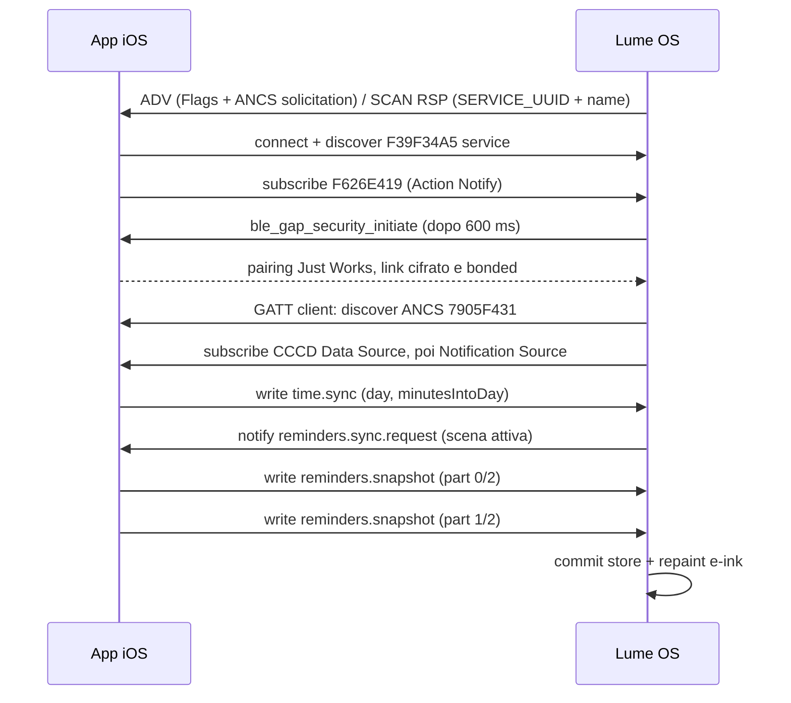
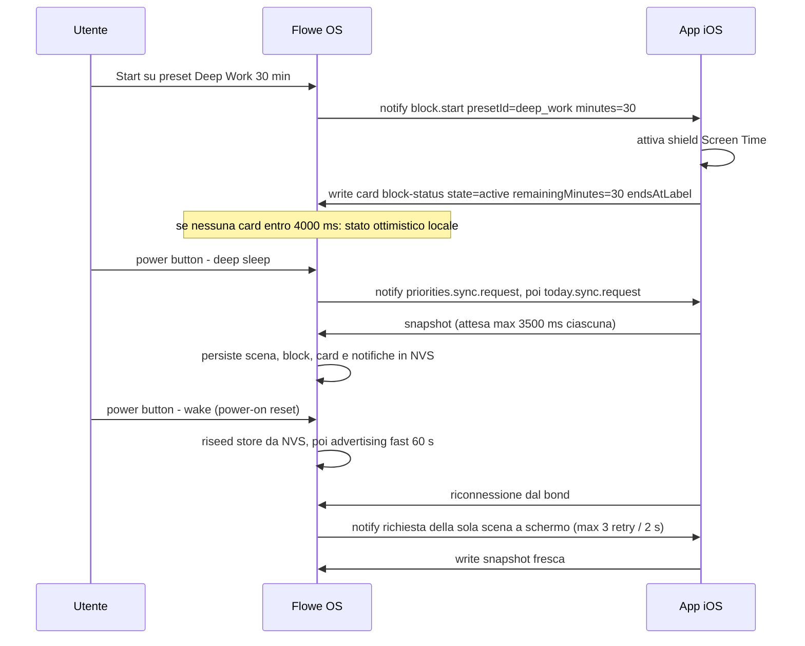

# Protocollo BLE di Lume — specifica implementativa

Tutti i riferimenti sono al modulo firmware `xphone-os/`. Percorsi abbreviati:
`src/…` = `xphone-os/src/…`. Il firmware è **GATT server (peripheral)** per il
canale card/command e **GATT client** verso ANCS sull'iPhone. Il companion Lume
implementato è in `ios/`.

> **Delta Lume v0.2:** il device è solo X3, si annuncia come `Lume X3` e usa
> UUID GATT propri. Il payload JSON e i limiti restano compatibili, ma l'isolamento
> impedisce alla vecchia app Flowe di rispondere alle richieste Lume e
> sovrascriverne lo snapshot. L'app scansiona per UUID, mai per nome. Il canale
> GATT richiede il link cifrato.

File sorgente rilevanti: `src/ble/CompanionProtocol.h` (UUID + limiti), `src/ble/CompanionBleService.{h,cpp}` (peripheral, parser card, comandi in uscita), `src/ble/CompanionAncsClient.{h,cpp}` (ANCS), `src/CompanionSync.{h,cpp}` (registry resync per scena), `src/NotificationStore.*`, `src/NotificationFilter.*`, store consumer `src/{PrioritiesStore,TodayStore,WorkoutStore,BlockStatusStore,ClockStore}.*`.

## 1. Identità e advertising

| Elemento | Valore | Evidenza |
|---|---|---|
| Local Name (Complete) | `Lume X3` | `src/ble/CompanionProtocol.h:22` |
| Identità BLE | random-static `D2:<40 bit bassi del MAC BT hardware>`; stabile per device e diversa dall'identità pubblica upstream | `src/ble/CompanionBleService.cpp`, `configureLumeBleIdentity()` |
| Nome: limite | scartato se vuoto o >29 caratteri | `src/ble/CompanionBleService.cpp`, `addCompleteName()` |
| ADV packet | Flags `0x01` = LE General Disc + BR/EDR not supported (3 B) + **Service Solicitation 128-bit** (`0x15`) con l'UUID ANCS `7905F431-B5CE-4E99-A40F-4B1E122D00D0` (18 B) = 21 B | `addFlags()`, `addAncsSolicitation()` |
| SCAN RESPONSE | Complete List of 128-bit Service UUID = `SERVICE_UUID` (18 B) + Complete Local Name (11 B) = 29 B | `CompanionBleService::begin()` |
| Appearance / Manufacturer Data / TX Power | **non presenti nel codice** | — |
| Intervalli ADV | Fast 48–96 unità 0,625 ms = **30–60 ms** per 60 000 ms dopo boot o dopo ogni disconnessione; poi Slow 640–800 = **400–500 ms** a tempo indeterminato | `applyAdvIntervals()`, `startAdvertising()` |
| Hint intervallo di connessione | `setMinPreferred(0x06)` / `setMaxPreferred(0x12)` (7,5–22,5 ms) | `CompanionBleService::begin()` |

**Conseguenza per iOS:** l'app **deve** scansionare/riconnettere per `SERVICE_UUID`, non per nome. UUID GATT e identità BLE sono entrambi dedicati: i soli UUID non isolano un iPhone già associato, perché CoreBluetooth può ripristinare il vecchio peripheral e riusare handle in cache. La solicitation ANCS abilita il riaggancio in background del bond Lume.

Il radio si accende **dopo** il primo paint della launcher (`src/main.cpp:300-307`); se il boot ripristina la scena Reader, BLE **non parte affatto** finché non si esce dal reader (`src/main.cpp:300-301`). Reader: BLE spento e ri-inizializzato all'uscita (`src/ble/CompanionBleService.h:57-58`); File Transfer: stack distrutto e memoria rilasciata fino al riavvio (`src/ble/CompanionBleService.h:45-50`).

## 2. Pairing, encryption, bonding

* Configurazione: `setAuthenticationMode(bonding=true, mitm=false, sc=true)`, IO capability `ESP_IO_CAP_NONE`, chiavi ENC+ID in init e resp → **Just Works, LE Secure Connections, senza passkey** (`src/ble/CompanionBleService.cpp:202-206`).
* L'iniziativa è **del device**: alla connessione il callback arma un pump (`armSecurity`, fuse 600 ms) e il main loop chiama `ble_gap_security_initiate` (`:583-591`, `:717-756`). `rc == 0` o `BLE_HS_EALREADY` → attesa di ENC_CHANGE. Un fallimento è ritentato **una sola volta** dopo 2000 ms (`:635-645`, `:739-748`).
* Bond persistiti nella partizione NVS di NimBLE; sopravvivono al deep sleep, che non fa teardown dello stack (`src/Sleep.cpp:356-363`).
* ANCS è ammesso solo su link **cifrato**: la discovery parte da `onAuthenticationComplete` con `sec_state.encrypted` (`src/ble/CompanionAncsClient.cpp:778-797`) o dal watchdog (§9).
* Lume imposta `WRITE_ENC` su Card Write e `READ_ENC` su Action Read/Notify (`src/ble/CompanionBleService.cpp:226-240`): una card non viene accettata prima della cifratura del link.

## 3. Parametri di connessione e MTU

* MTU preferito richiesto dal device: **517** (`src/ble/CompanionBleService.cpp:188`). Fallback assunto quando l'MTU non è ancora negoziato: 185 (`:1255`, `:1338`).
* Circa 1 s dopo la sottoscrizione di entrambe le CCCD ANCS il device chiede parametri low-duty: `itvl_min=72` (90 ms), `itvl_max=144` (180 ms), `latency=4`, `supervision_timeout=200` (2000 ms) — scelti per le regole Apple Accessory Design (`src/ble/CompanionAncsClient.cpp:901-947`). iOS può rifiutare: il link resta sui parametri precedenti.
* Latenza pratica di un round-trip comando→card su link low-duty: ~1,8 s (motivo dei timeout a 3500 ms in `src/Sleep.cpp:320-336`).
* Dopo la disconnessione il device torna in fast advertising per 60 s (`src/ble/CompanionBleService.cpp:544-554`).

## 4. Servizio GATT (companion)

| Caratteristica | UUID | Proprietà | Direzione | Payload |
|---|---|---|---|---|
| Service | `F39F34A5-7DDD-487B-85B6-CE7695466BAE` | — | — | — |
| Card Write | `F6361620-0F61-40E9-AA80-5252733C5416` | `WRITE`, `WRITE_NR`, `WRITE_ENC` | phone → device | JSON UTF-8, una card per write |
| Action Notify | `F626E419-C6A8-4048-B684-98C4604D19A3` | `READ`, `NOTIFY`, `READ_ENC` | device → phone | JSON UTF-8, un messaggio per notify |

Fonte: `src/ble/CompanionProtocol.h:23-25`, `src/ble/CompanionBleService.cpp`, `CompanionBleService::begin()`. Valore iniziale leggibile della Action: `{"schemaVersion":1,"type":"ready"}`.

### Limiti, framing, errori sull'ingresso

* Un write **non frammentato dal protocollo**: il payload utile è ≤ `ATT_MTU − 3` (≈514 B con MTU 517). `MAX_CARD_BYTES = 4096` è il cap di sicurezza del parser, raggiungibile solo con long write/prepare write (`src/ble/CompanionProtocol.h:36`, `src/ble/CompanionBleService.cpp:680`, `:760`).
* Nessun chunking a livello di trasporto in ingresso. Le snapshot lunghe si spezzano **a livello applicativo** con i campi `part` (0-based) e `parts`, con lo stesso `id` per tutte le fette; default `part=0`, `parts=1` (`src/ble/CompanionProtocol.h:125-130`, `src/ble/CompanionBleService.cpp:864-865`). Solo `PrioritiesStore` implementa l'assemblaggio (staging per parte, commit su `part+1 >= parts`) — `src/PrioritiesStore.cpp:19-44`.
* Il callback NimBLE **non parsifica**: copia i byte in una FIFO da **4 slot**; a FIFO piena viene scartato **il più vecchio** (`src/ble/CompanionBleService.h:186-189`, `.cpp:677-697`). Il parse gira sul main loop, che svuota tutta la FIFO per tick (`:699-715`).
* Payload vuoto o >4096 B: nessuna risposta, solo `statusMessage = "Rejected card payload"` (`:680-683`).
* JSON malformato: log + `"Bad card JSON"`, card scartata (`:766-771`).
* **Non esiste ACK, NACK, sequence number o flow-control in ingresso.** L'app iOS non ha alcun modo protocollare di sapere se una card è stata applicata; l'unico feedback è il comportamento successivo del device (nuove richieste di sync).
* Tipi `camera.image.*`: accettati e scartati (`:774-779`).

## 5. Card phone → device

Chiavi comuni lette da `applyCardPayload` (`src/ble/CompanionBleService.cpp:851-878`), con clip in **byte** ai limiti di `CompanionProtocol.h:30-44`:

| Chiave | Tipo | Default | Cap | Semantica |
|---|---|---|---|---|
| `type` | string | `""` | — | dispatch; usato anche come fallback di `kind` |
| `kind` | string | valore di `type` | 64 | routing verso gli store |
| `id` | string | `"card"` | 64 | identità card; prefissi/valori speciali per il routing |
| `title` | string | `"Untitled"` | 96 | titolo |
| `body` | string | `""` | 512 | riga di stato (Priorities la usa come `syncLine`) |
| `state` | string | `""` | 64 | `active` / `break` / `ready` per Block |
| `preset` | string | `""` | 96 (ma store 23) | titolo preset Block |
| `weather`, `highLow`, `sync` | string | `""` | 96 | banda meteo + riga “Synced …” di Today |
| `endsAtLabel` | string | `""` | 48 (store 15) | orario fine blocco formattato dal telefono, es. `10:30 AM` |
| `durationMinutes`, `remainingMinutes` | int | 0 | — | Block |
| `blocksToday`, `blockStreak`, `blocksTotal` | int | 0 | — | contatori Block |
| `part`, `parts` | int | 0 / 1 | — | multi-part |
| `source` | string **oppure** oggetto `{displayName\|app}` | `"iPhone"` | 64 | etichetta sorgente (solo diagnostica) |
| `actions[]` | array di `{id,label}` | — | max 4, id 64, label 32 | **parsati ma mai usati** (attrito 3) |
| `items[]` | array (Today) | — | max 6 | vedi §5.2 |
| `reminderItems[]` | array | — | max 40 | vedi §5.1 |
| `reminderLists[]` | array di `[index,nome]` | — | max 4, nome 24 | solo nella parte 0; vedi §5.1 |
| `gen` | uint16 | — | — | generazione della mappa maniglia→promemoria (§5.1) |
| `workoutItems[]` | array | — | max 8 | vedi §5.3 |
| `mailItems[]`, `mailSource`, `mailSync` | — | — | max 8 | **parsati e mai letti da nessuno** (attrito 2) |

Routing verso gli store (`:984-1012`):

* Reminders: `kind == "reminders.snapshot"` **oppure** `id` inizia con `reminders-sync-`.
* Today: `kind == "today.snapshot"` oppure `id` inizia con `today-sync-`. Il payload grezzo viene anche memorizzato per la persistenza NVS.
* Workout: `kind == "workout.snapshot"` oppure `id` inizia con `workout-sync-`.
* Block: `id == "block-status"` (esatto).

### 5.1 reminders.snapshot

**Sostituisce `priorities.snapshot` (rimossa, senza compatibilità).** Decisione di prodotto
registrata in [14-decisioni.md](14-decisioni.md): la fonte di verità delle cose da fare sono
i **Promemoria iOS**, non un database dell'app. Il telefono invia solo promemoria **aperti**
delle liste che l'utente ha selezionato, quindi non esiste un campo `done` in ingresso:
spuntare sul device significa che alla snapshot successiva la voce non c'è più.

Item accettato come **array di 4 elementi** `[handle, listIndex, title, dueLabel]` o come
oggetto `{h,l,t,d}`. Cap: 40 item nel pool, 4 liste, `title` 96 B, `dueLabel` 16 B, nome
lista 24 B; lato telefono, massimo 20 item per lista.

* `handle` — `uint16` 1..65535 (0 non valido). **Non** è un identificatore EventKit: quelli
  sono lunghi e il cap del campo `id` è 64 B. La mappa maniglia→promemoria vive sul telefono.
* `gen` — `uint16`, generazione della mappa, nuova a ogni refresh. Il device la conserva e la
  rimanda in `reminder.toggle`; il telefono **rifiuta** un toggle con generazione stale e
  risponde con una snapshot fresca. Senza questo, un toggle in volo durante un riordino
  spunterebbe la voce sbagliata — lo stesso difetto che `workout.set` ha per indice.
* `dueLabel` — formattata e **localizzata dal telefono** (≤16 caratteri, `""` se il
  promemoria non ha data). Il firmware non interpreta date: le disegna.

```json
{"schemaVersion":1,"type":"card","kind":"reminders.snapshot",
 "id":"reminders-sync-1786717487","body":"3 da fare","gen":41,
 "part":0,"parts":1,
 "reminderLists":[[0,"Oggi"],[1,"Casa"]],
 "reminderItems":[[17,0,"Chiamare il commercialista","Oggi 09:00"],
                  [18,0,"Rinnovare l'assicurazione","Scaduto"],
                  [19,1,"Comprare lampadine",""]]}
```

Multi-part: stessa `id`, gli item si distribuiscono sulle parti mentre `reminderLists`, `body`
e `gen` viaggiano identici in ognuna; il commit (e quindi il repaint) avviene solo con la
fetta finale. Le fette devono arrivare **in ordine** e in numero ≤4 per tick di loop,
altrimenti la FIFO ne perde (attrito 5).

Le liste selezionate diventano **schede** sul device, nell'ordine scelto nell'app. Il tetto di
4 liste e 40 item non è arbitrario: ogni item costa ~120 B di RAM statica e il reader ha
bisogno di un blocco heap contiguo da 32 KB che con BLE connesso ha ~36 KB di margine.

### 5.2 today.snapshot (agenda + banda meteo)

Item: array a 5 `[kind, time, title, subtitle, state]` o oggetto con le stesse chiavi
(`:889-908`). Cap: 6 item; `kind` 64, `time` 48, `title` 96, `subtitle` 48, `state` 64
(`state` viene salvato nella card ma **non copiato nello store**, `src/TodayStore.cpp:20-37`).

Today è **solo agenda**: eventi del calendario nelle prossime 24 ore. Il valore
`kind == "reminder"` non arriva più e non è più gestito — i promemoria hanno la loro card
(§5.1), che è anche l'unico posto da cui si spuntano. Prima comparivano in entrambe le
viste, ed era la duplicazione che la §5.1 elimina.

```json
{"schemaVersion":1,"type":"card","kind":"today.snapshot","id":"today-sync-1755000000",
 "title":"Today","weather":"Partly cloudy","highLow":"H 24 / L 14","sync":"Synced 9:41 AM",
 "items":[["event","9:00 AM","Standup","Zoom",""],
          ["event","11:30 AM","Dentist","Via Roma 4",""]]}
```

### 5.3 workout.snapshot

Item: array a 4 `[id, name, sets, done]` o oggetto (`:958-975`). Cap: 8 item, `id` 64, `name` 48, `sets` clampato 0..99, `done` clampato 0..`sets` (`src/WorkoutStore.cpp:33-47`). `workoutDate` è clippato a **16 byte** e serve al guard anti-regressione: a parità di data, per ogni `id` il device conserva `max(done_locale, done_ricevuto)` — i set contati offline non vengono cancellati da una snapshot vecchia (`src/WorkoutStore.cpp:17-49`).

```json
{"schemaVersion":1,"type":"card","kind":"workout.snapshot","id":"workout-sync-1755000000",
 "title":"Workout","workoutDate":"2026-08-13",
 "workoutItems":[["w1","Bench 135lb",5,2],["w2","Pushups x20",3,3]]}
```

### 5.4 block-status

`id` **deve** essere esattamente `block-status`. Interpretazione (`src/BlockStatusStore.cpp:30-56`):

* `active` = `state ∈ {active, break}`, **oppure** euristica testuale: `title` contiene `min left` o `break`, o `body` contiene `min left` o `paused`.
* `onBreak` = `state == "break"` o `body` contiene `paused`; `ready` = `state == "ready"`.
* `remainingMinutes ≤ 0` → fallback: scraping delle cifre di `title` prima di `" min"`.
* `preset` clippato a 23 caratteri, `endsAtLabel` a 15.

```json
{"schemaVersion":1,"type":"card","id":"block-status","kind":"block.status",
 "title":"18 min left","body":"Deep Work","state":"active","preset":"Deep Work",
 "durationMinutes":30,"remainingMinutes":18,"endsAtLabel":"10:30 AM",
 "blocksToday":2,"blockStreak":5,"blocksTotal":137}
```

Il device attende una card di conferma entro **4000 ms** da un comando `block.start/break/stop`, altrimenti passa a uno stato ottimistico locale (`src/scenes/BlockScene.cpp:67`, `:267-305`).

### 5.5 Messaggi di controllo (non diventano card)

| `type` | Campi | Effetto | Evidenza |
|---|---|---|---|
| `time.sync` | `day` (uint32 `yyyymmdd`), `minutesIntoDay` (uint16) | unica fonte d'orario: nessun RTC. Aggiorna `ClockStore`, timbra `firstSyncMs` alla prima ricezione | `:813-825`, `src/ClockStore.h:16-21` |
| `notif.filter` | `apps`: array di bundle id = **blocklist completa** (array vuoto = mostra tutto) | max 16 voci, bundle clippato a 31 caratteri, persistito subito su NVS (`xphone`/`notifBlkList`) | `:788-808`, `src/NotificationFilter.{h:20,cpp:71-127}` |
| `notif.apps.request` | — | il device risponde con notify `notif.apps` chunkate | `:809-812`, `:1332-1403` |
| `reader.shelf.request` | — | latch; il main loop scandisce `/books` e risponde `reader.shelf` | `:784-787`, `src/main.cpp:496-498` |
| `transfer.start` / `transfer.stop` | — | apre/chiude la scena File Transfer (Wi-Fi); `start` **spegne BLE fino al reboot** | `:826-833`, `src/main.cpp:499-505` |
| `transfer.wifi` | `ssid`, `password` | salva le credenziali Wi-Fi in NVS e risponde `transfer.status` `wifi-saved`/`wifi-error` | `:834-843` |

## 6. Messaggi device → phone (Action Notify)

Tutti hanno `schemaVersion: 1`; i comandi hanno `sequence` = contatore monotono per boot (`actionSequence`). Vengono emessi **solo** se connesso (`connected && actionCharacteristic`), altrimenti la funzione ritorna `false` e la UI mostra “Companion unavailable”.

| `type` | Campi extra | Quando | Cosa deve fare il telefono | Evidenza |
|---|---|---|---|---|
| `block.start` | `presetId` + `preset` (stessi valori, solo se non vuoti), `minutes` (solo se >0) | tasto Start nella scena Block | avviare lo shield Screen Time e rispondere con card `block-status` `state=active` | `:1068-1069`, `:1180-1213`, `src/scenes/BlockScene.cpp:216-226` |
| `block.break` | `minutes` (5) | scelta “5 min break” | mettere in pausa e rispondere `state=break` | `:1072`, `src/scenes/BlockScene.cpp:240-246` |
| `block.stop` | — | scelta “Stop now” | terminare il blocco, rispondere `state=ready` e aggiornare i contatori | `:1074` |
| `block.status` | — | onEnter Block, resync al risveglio, fine countdown a 0 | rispondere con la card `block-status` corrente | `:1076`, `src/scenes/BlockScene.cpp:166-167`, `:300-301` |
| `reminders.sync.request` | — | onEnter Promemoria, soft-key Sync, resync al connect, pre-sleep | rispondere `reminders.snapshot` | `src/scenes/RemindersScene.cpp`, `src/Sleep.cpp` |
| `reminder.toggle` | `gen` (uint16), `handle` (uint16), `done` (bool, sempre true) | CONFIRM su una voce | verificare `gen`, scrivere `EKReminder.isCompleted = true`, salvare in EventKit e rispondere con una snapshot fresca. Con `gen` stale: **non** scrivere, rimandare solo la snapshot | `src/scenes/RemindersScene.cpp` |
| `today.sync.request` | — | onEnter Today, resync, pre-sleep | rispondere `today.snapshot` | `:1080`, `src/scenes/TodayScene.cpp:156`, `src/Sleep.cpp:342` |
| `workout.sync.request` | — | onEnter Workout, resync | rispondere `workout.snapshot` | `:1116`, `src/scenes/WorkoutScene.cpp:87` |
| `workout.set` | `id`, `done` (int **assoluto**, non delta) | +/- su un esercizio (coalescato, inviato anche in `flushPendingSend` prima del sleep) | scrivere il conteggio assoluto; l'idempotenza è garantita dal valore assoluto | `:1120-1150`, `src/scenes/WorkoutScene.cpp:31-33` |
| `transfer.status` | `state` (`connecting`/`running`/`stopped`/`needs-wifi`/`wifi-saved`/`wifi-error`), `ip?`, `detail?` | transizioni della scena File Transfer | mostrare stato/IP; dopo `connecting` il BLE cade | `:1229-1244`, `src/scenes/FileTransferScene.cpp:53,82,106,175` |
| `reader.shelf` | `tok` (uint32 = `millis()`), `seq` (0-based), `done` (bool), `books`: `[[nome, byte], …]` | dopo `reader.shelf.request` | riassemblare i chunk con `tok` uguale finché `done=true` | `:1246-1330` |
| `notif.apps` | `tok`, `seq`, `done`, `apps`: `[{"id":bundle,"name":display,"n":conteggio}]` | dopo `notif.apps.request` | popolare il picker della blocklist; `n` = notifiche viste in questo ciclo di alimentazione | `:1332-1403` |
| `card.action` | `cardId`, `actionId`, `label` | **mai** — `sendAction()` non ha chiamanti | — | `:1031-1066` |

Chunking in uscita (solo `reader.shelf` e `notif.apps`): NimBLE **tronca** una notify oltre `ATT_MTU − 3` invece di frammentarla, quindi il device dimensiona i chunk sull'MTU vivo (fallback 185), con overhead di envelope 96 B (shelf) / 100 B (apps), buffer `char json[560]`, `delay(20)` fra chunk, max 128 libri, nome file ≤95 B (`:1251-1330`, `:1335-1403`).

## 7. Flusso di sync

Il telefono **non** deve pushare snapshot spontanee: il device chiede, il telefono risponde (`src/Sleep.cpp:310-313`). Regole:

* Ogni scena card chiede i propri dati in `onEnter` (lazy, per-rail).
* Sul fronte `isConnected()` false→true il main loop chiede **solo** i dati della scena a schermo (`CompanionSync::requestActive()`), con backstop di **3 ritentativi** ogni **2000 ms**, interrotto quando la revision dello store avanza o il link cade (`src/main.cpp:389-430`, `src/CompanionSync.cpp:51-69`).
* Le scene senza rail (Notifications/Launcher/Settings/About) non generano richieste (`src/CompanionSync.cpp:22-30`).
* Prima del deep sleep: `reminders.sync.request` e poi `today.sync.request`, ciascuno con attesa **fino a 3500 ms** con break anticipato (`src/Sleep.cpp:327-350`). I due comandi sono serializzati perché notify consecutive sulla stessa caratteristica si sovrascrivono.
* Sync dot in status bar: attivo se una richiesta è armata, se restano ritentativi o se il backfill ANCS non è vuoto; “busy” se qualcosa è in trasmissione (`src/main.cpp:354-363`).





## 8. ANCS

Il device è **client** ANCS. UUID (`src/ble/CompanionAncsClient.cpp:79-86`):

| Ruolo | UUID |
|---|---|
| Service | `7905F431-B5CE-4E99-A40F-4B1E122D00D0` |
| Notification Source (notify) | `9FBF120D-6301-42D9-8C58-25E699A21DBD` |
| Control Point (write) | `69D1D8F3-45E1-49A8-9821-9BBDFDAAD9D9` |
| Data Source (notify) | `22EAC6E9-24D6-4BB5-BE44-B36ACE7C7BFB` |

* Ordine: discovery servizio per UUID → discovery caratteristiche → CCCD **Data Source prima**, Notification Source dopo (raccomandazione Apple) → `ancsReady` (`:881-899`).
* Watchdog di discovery sul main loop: se connesso e ANCS non pronto da 4 s (12 s se una discovery è in volo), ri-lancia la discovery, max **5 tentativi** per connessione (`:804-831`).
* Notification Source: 8 byte `eventId, flags, categoryId, count, uid LE32`; pacchetti <8 B scartati (`:1156-1167`). Event id: 0 Added, 1 Modified, 2 Removed. Flag: Silent 0x01, Important 0x02, PreExisting 0x04, PositiveAction 0x08, NegativeAction 0x10. Categorie 0..11 mappate a etichette (`:105-132`, `:336-352`).
* Filtro Silent: gli eventi **live** Silent sono scartati; i PreExisting Silent **no** (iOS marca i replay con flags 0x15) — `:1168-1197`.
* Backfill: ogni UID (live o replay) entra in un ring da **20** slot; i live in testa, i preexisting in coda; a ring pieno si perde il più vecchio. Una sola `GetNotificationAttributes` in volo, timeout **3500 ms**, **un solo** retry per UID (`src/ble/CompanionAncsClient.h:202-227`, `.cpp:1228-1434`).
* `GetNotificationAttributes` richiede AppIdentifier, Title (max **80** B), Subtitle (80 B), Message (**240** B), Date; comando fisso da 16 byte (`:1062-1092`). Il buffer di riassemblaggio Data Source è **512 B**; overflow → reset del buffer e scarto (`:1472-1479`).
* Clip dei testi: `clipUtf8` taglia rispettando i confini UTF-8, poi `normalizeAsciiInPlace` traslittera la punteggiatura e **elimina emoji/simboli** non disegnabili (`:178-199`, `:272-293`, `:1520-1522`). Cap finali: appId **31** char + NUL, title **55** + NUL, message **111** + NUL (`src/NotificationStore.h:29-31`).
* Fallback del testo: title vuoto → `"Notification"`; message vuoto → subtitle, altrimenti la data (`:1526-1530`).
* Dedup: per UID (update in place), e per `date+title` quando l'UID è nuovo — così i replay dopo il wake si fondono con le righe ripristinate da NVS (`src/NotificationStore.cpp:20-57`).
* App display name: cache **24** voci × **24** char, risolta con `GetAppAttributes` (solo DisplayName) una volta per bundle, con lo stesso gate single-in-flight; fallback = ultimo segmento del bundle (`src/ble/CompanionAncsClient.h:175-185`, `.cpp:298-304`, `:1099-1116`, `:1582-1606`).
* Resync (unico meccanismo pull di ANCS): riscrittura della CCCD Notification Source off→on, throttle **5000 ms**; invocato dall'`onEnter` di Notifications e dalla soft-key Sync (`:593-622`, `src/scenes/NotificationsScene.cpp:59`, `:209`).
* Clear singolo: `PerformNotificationAction` con `ActionNegative`, solo se la categoria **non** è IncomingCall, se il flag NegativeAction è presente, se l'UID è della sessione corrente e non è ripristinato (bit 0x40000000). Coda da **8** azioni (`:624-674`, `:1281-1326`).
* Code host→main-loop: Notification Source 48 slot × 8 B, Data Source 6 slot × 512 B, statiche; high-water e drop count esposti in About (`:55-56`, `:1700-1767`).

**Cosa l'app iOS NON deve fare:** ANCS è fornito da iOS, non dall'app — non serve (né è possibile) implementarlo lato app; non serve alcuna entitlement notifiche; **non** inviare le notifiche come card; non tentare di sopprimere singole app via ANCS (impossibile: la blocklist è device-side, `src/NotificationFilter.h:5-8`); non chiudere il bond, perché senza link cifrato/bonded la discovery ANCS fallisce con insufficient authentication (`:579-583`).

## 9. NotificationStore

Ring buffer fisso da **24** `Entry` di **224 byte** (~5,4 KB BSS): `uid`, `timestampMs`, `sortKey` (uint64 `YYYYMMDDHHMMSS` dalla data ANCS), `sessionId`, `appId[32]`, `title[56]`, `message[112]`, `categoryId`, `flags` (`src/NotificationStore.h:24-48`). Il blocco usato è mantenuto ordinato per `sortKey`, quindi `get(0)` è sempre la più recente **per data**, indipendentemente dall'ordine dei replay (`.cpp:81-96`). `sortKey == 0` affonda in coda e viene scartato prima.

`sessionId` è la generazione della connessione ANCS (incrementata a ogni connect, 0 riservato alle righe ripristinate) e vincola le azioni: un CLEAR non può mai agire su un UID di una sessione precedente (`src/ble/CompanionAncsClient.cpp:721-729`, `src/NotificationStore.h:39-42`).

Persistenza attraverso il sleep (`src/Sleep.cpp:69-80`, `:292-303`, `:471-493`): namespace NVS `xphone`, chiave `notifStore` = blob raw delle **10** entry più recenti (~2,2 KB), chiave `notifTombs` = tombstone (8 slot, `sortKey`+`title`). Al boot `restore()` rifiuta blob di dimensione non multipla di `sizeof(Entry)` (upgrade di firmware) e re-inserisce con `RESTORED_UID_BIT` (0x40000000) e `sessionId = 0`; il backfill successivo si fonde per `date+title`. I tombstone sopprimono i replay già cancellati e riprovano il dismiss con l'UID fresco (`src/ble/CompanionAncsClient.cpp:1542-1549`).

## 10. Note per l'app iOS custom (CoreBluetooth)

1. **Ruolo:** solo `CBCentralManager`. Nessun `CBPeripheralManager`: ANCS è servito dal sistema.
2. **Background modes:** `bluetooth-central` in `UIBackgroundModes`. Riconnessione con `CBCentralManagerOptionRestoreIdentifierKey` (state restoration) e `scanForPeripherals(withServices: [6E400001-…])`; il device può stare in slow advertising 400–500 ms.
3. **Ordine di scoperta:** connect → bonding/cifratura avviati dal device → `discoverServices([6E400001…])` → `discoverCharacteristics` → `setNotifyValue(true)` su `6E400003` **prima** di scrivere. Le caratteristiche cifrate possono produrre `insufficientEncryption` finché il pairing non è completo: attendere il completamento e ritentare senza eliminare il bond.
4. **Dimensione write:** tenere ogni card ≤ ~500 byte utili e spezzare con `part`/`parts`; usare `.withResponse`, attendere `didWriteValueFor` prima della fetta successiva e applicare un timeout/reconnect (Lume iOS usa 8 s).
5. **Frequenza write:** max 4 write in volo (FIFO del firmware); il main loop gira a ~10 ms ma può essere occupato da un refresh e-ink. Spaziare le fette di almeno un intervallo di connessione (~180 ms) e non superare 4 write consecutive senza pausa.
6. **UTF-8:** dalla v0.4 il clip lato firmware avviene su **confine di codepoint** sia per le card sia per ANCS (`src/ble/Utf8Clip.h`), quindi un accento o una emoji sul limite non produce più mojibake. Restano comunque due ragioni per pre-troncare lato iOS: il testo tagliato dal device non lo scegli tu, e il font UI copre Latin-1 + Latin Ext-A, quindi le emoji non hanno glifo.
7. **Handler obbligatori:** `reminders.sync.request`, `today.sync.request`, `workout.sync.request`, `block.status`, `reminder.toggle`, `workout.set`, `block.start|break|stop`. Ignorare in modo innocuo i tipi ignoti (`card.action`, `transfer.status`, `reader.shelf`, `notif.apps`) se non si implementano quelle funzioni.
8. **Nessun ACK:** progettare la logica come idempotente e stateless per messaggio (`workout.set` è già assoluto). Rispondere sempre con una snapshot completa, non con delta.
9. **Disconnessioni previste e legittime:** apertura del Reader (BLE spento e riavviato), File Transfer (BLE distrutto fino al reboot), deep sleep (nessun teardown, cade per supervision timeout). Non trattarle come errore né come unpairing.
10. **Orologio:** inviare `time.sync` appena il canale è pronto, e ripeterlo su cambio giorno. Dalla v0.4 il device ha un orologio hardware (DS3231) che semina l'ora al boot, ma il telefono resta l'autorità su fuso e ora legale: è `time.sync` che corregge il chip quando divergono di oltre un minuto.

## Cose da sistemare / attriti

1. **[RISOLTO IN LUME v0.2] Card su link non cifrato.** Card Write dichiara `WRITE_ENC`; Action Read/Notify dichiara `READ_ENC` (`src/ble/CompanionBleService.cpp:226-240`). Resta da provare su hardware con un central non bonded.
2. **Percorso “mail” morto.** `mailItems`/`mailSource`/`mailSync` sono parsati in `CompanionCardState` (8 × `CompanionMailItem`, 6 `std::string` ciascuno) ma nessun consumer li legge (`src/ble/CompanionBleService.cpp:910-931`; ricerca in `src/`: nessun altro riferimento). Costa allocazioni heap nello slot di parse da ~3,6 KB su un device con 320 KB. **Gravità: media.** Fix: eliminare struct, cap e blocco di parsing.
3. **`actions[]` + `card.action` codice morto.** `sendAction()` non ha chiamanti (`:1031-1066`) e l'array `actions` esiste solo per lui (`:880-887`, `src/ble/CompanionProtocol.h:47-50`). **Gravità: bassa.** Fix: rimuovere entrambi, oppure agganciare le action alle soft-key se serve un canale generico.
4. **`part`/`parts` onorati solo dallo store dei promemoria.** `TodayStore::updateFromCard` e `WorkoutStore::updateFromCard` sovrascrivono lo stato a ogni fetta (`src/TodayStore.cpp:20-37`, `src/WorkoutStore.cpp:17-49`): una snapshot Today/Workout multi-part lascia sul vetro solo l'ultima fetta. **Gravità: media.** Fix: portare lo staging di `RemindersStore` in una utility condivisa, o rifiutare `parts > 1` per quei tipi.
5. **La FIFO da 4 slot perde silenziosamente le fette di una snapshot multi-part.** A FIFO piena si scarta il payload più vecchio (`src/ble/CompanionBleService.cpp:690-695`) e lo store dei promemoria continua a impilare dal cursore di staging, committando una lista sbagliata senza segnalare nulla. **Gravità: media.** Fix: validare la continuità di `part` (contatore atteso) e invalidare lo staging se una fetta manca — la v0.5 lo fa nel nuovo `RemindersStore`, resta da fare per Today/Workout.
6. **Nessun ACK/errore verso il telefono.** Payload rifiutato, JSON malformato e OOM del parser aggiornano solo una stringa locale (`:680-683`, `:766-771`, `:846-849`). L'app iOS non può distinguere “card applicata” da “card persa”. **Gravità: media.** Fix: notify `card.ack {id, part, ok, reason}` sulla Action characteristic.
7. **Notify che si sovrascrivono.** Ogni `send*` fa `setValue` + `notify` senza coda né conferma; due comandi nello stesso tick si clobberano — problema noto e aggirato a mano serializzando le richieste pre-sleep (`src/Sleep.cpp:337-341`, `:1152-1178`). **Gravità: media.** Fix: piccola coda TX drenata su completamento notify.
8. **[RISOLTO IN LUME v0.2] Resync ANCS sticky.** `requestResync()` arma `resyncPending`; `pumpResync()` parte da `processQueue()` quando ANCS/link cifrato sono pronti, serializza CCCD off→on e ri-arma la richiesta se la subscribe fallisce (`src/ble/CompanionAncsClient.cpp`).
9. **Hint di intervallo di connessione probabilmente non trasmesso.** `setMinPreferred/setMaxPreferred` (`:269-270`) alimentano la ricostruzione dei dati di advertising, che secondo il commento a `:304-312` viene **saltata** perché sono impostati adv e scan-response custom → l'AD Slave Connection Interval Range non finisce in aria. [INFERENZA: dedotta dal commento nel codice, framework non verificato in repo.] **Gravità: bassa.** Fix: inserire l'AD a mano in `BLEAdvertisementData` o rimuovere le due chiamate ingannevoli.
10. **Clip in byte sui campi card, senza protezione UTF-8.** `clippedString` taglia a metà sequenza multibyte (`:84-91`), mentre il percorso ANCS usa `clipUtf8` (`src/ble/CompanionAncsClient.cpp:178-199`): un titolo di priorità con emoji al confine dei 96 byte diventa mojibake. **Gravità: media.** Fix: riusare `clipUtf8` anche nel parser card.
11. **Blocklist notifiche: collisione sui bundle id lunghi.** Confronto su 32 byte con clip a 31 caratteri (`src/NotificationFilter.cpp:32-39`): due app che condividono i primi 31 caratteri di bundle id vengono bloccate insieme. **Gravità: bassa.** Fix: confrontare l'hash del bundle completo o allargare il campo.
12. **`MAX_CARD_BYTES = 4096` irraggiungibile e ingannevole.** Un write singolo è limitato a `ATT_MTU−3` (~514 B) e il firmware non implementa long write: il limite documentato nel protocollo (`src/ble/CompanionProtocol.h:36`) non corrisponde alla capacità reale, motivo per cui iOS deve spezzare a ~512 B (`:125-128`). **Gravità: bassa.** Fix: allineare la costante all'MTU reale o abilitare le prepare write.
13. **`workoutDate` clippato con letterale 16 invece di una costante di protocollo** (`:976`) mentre gli altri campi usano `CompanionProtocol::*`; lo store ha `_date[17]` (`src/WorkoutStore.h:64`). **Gravità: bassa.** Fix: introdurre `MAX_WORKOUT_DATE_CHARS`.
14. **`block.start` invia due volte lo stesso valore** (`presetId` e `preset`, `:1197-1200`) per compatibilità con un'app iOS che non è in repo. **Gravità: bassa.** Fix in un fork con app nuova: tenere solo `presetId`.
15. **Riconoscimento del blocco basato su euristiche di testo inglese.** `BlockStatusStore::updateFromCard` deduce `active`/`onBreak` cercando `"min left"`, `"break"`, `"paused"` in `title`/`body` (`src/BlockStatusStore.cpp:30-38`): qualunque app iOS localizzata rompe la logica. **Gravità: media.** Fix: rendere `state` obbligatorio e cancellare le euristiche.
16. **`today.sync.request` senza produttore noto.** Il commento nel firmware dichiara che l'app iOS esistente non ha handler per questo tipo (`src/ble/CompanionBleService.h:118-124`), però il resync al wake e il pre-sleep lo usano come unico canale per Today (`src/CompanionSync.cpp:38`, `src/Sleep.cpp:342`): su una app che non lo implementa, Today resta fermo. **Gravità: media (per chi scrive l'app: obbligatorio implementarlo).**
17. **Incoerenza README/codice sul canale card.** Il README descrive il canale come “JSON cards over a simple GATT service” senza menzionare il vincolo di ~512 B per write né il multi-part (`README.md:59-61`), il che porta a implementazioni iOS che superano il limite e vengono troncate/rifiutate. **Gravità: bassa.** Fix: linkare questa specifica dal README.
