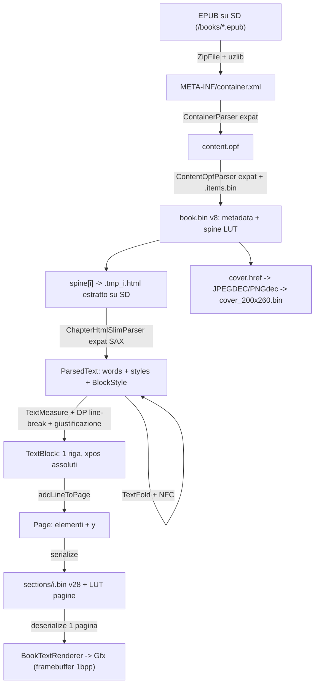

# Reader EPUB (Flowe OS)

Motore EPUB in `xphone-os/src/reader/` (porting *pruned* del reader CrossPoint: CSS, TOC, immagini, bidi/RTL, CJK, sillabazione Liang e focus-reading sono stati rimossi mantenendo però il **layout binario** dei file cache). Scena: `src/scenes/ReaderScene.{h,cpp}`. Librerie vendorizzate coinvolte: `lib/{ZipFile,InflateReader,uzlib,expat,EpdFontCore,PNGdec,JPEGDEC,ReaderFs,Utf8,Serialization,Memory,XmlParserUtils}`.

Modello di base: **paginate-once**. Un capitolo (spine item) viene impaginato una volta e serializzato pagina per pagina su SD (`sections/<n>.bin`); a runtime ogni giro pagina deserializza **una** `Page` e la disegna. Nessun re-layout in fase di render (`ReaderScene.cpp:891-920`).

## Pipeline



| Stadio | Codice | Strutture / limiti |
|---|---|---|
| ZIP + inflate | `lib/ZipFile/ZipFile.cpp:447-600`, `lib/InflateReader/InflateReader.h:39-115` | `FileStatSlim{method,compressedSize,uncompressedSize,localHeaderOffset}`; scan EOCD su ultimi 1024 B (`ZipFile.cpp:235-236`); chunk letture 512/1024 B; finestra deflate 32 KB |
| container.xml | `ContainerParser.cpp:58-88` | accetta solo `rootfile` con `media-type="application/oebps-package+xml"`; buffer expat 1024 B |
| content.opf | `ContentOpfParser.cpp:100-345` | stati `START..IN_GUIDE`; manifest riversato in `<cache>/.items.bin` (coppie `id`,`href` length-prefixed); risoluzione `itemref/@idref` con **scan lineare** del file temp (`:226-236`); `dc:title/creator/language`, `guide type="text"`, cover (precedenza `properties="cover-image"` > `<meta name="cover">` image/* > href contenente "cover", `:308-314`) |
| spine cache | `BookMetadataCache.cpp:69-173` | `book.bin` v8; `SpineEntry{href, cumulativeSize, tocIndex}`; `cumulativeSize` = somma dimensioni **inflate** (`ZipFile::getInflatedFileSize`, `:146`); `tocCount` sempre 0 |
| HTML capitolo | `ChapterHtmlSlimParser.cpp:235-633` | buffer parse 1024 B (`:26`); `MAX_WORD_SIZE 200` (`ChapterHtmlSlimParser.h:29`), troncamento UTF-8-safe (`:512-531`); `MAX_WORDS_PER_TEXT_BLOCK 192` (`.h:77`) con flush forzato (`:150-157`); `blockStyleStack.reserve(8)` (`:645`) |
| fold glifi | `TextFold.cpp:85-150` | Greco→latino, `™→(TM)`, frecce→ASCII, emoji scartate; passthrough per <0x0370, Cirillico, 0x2012-0x2064, valute (`:91-95`) |
| misura + righe | `TextMeasure.cpp:13-76`, `ParsedText.cpp:197-310` | avanzamenti 12.4 fixed-point, kern 4.4, *differential rounding*; line-break DP O(n²) con costo `remainingSpace²`; split d'emergenza per parole più larghe della riga (`ParsedText.cpp:316-368`) |
| riga → pagina | `ChapterHtmlSlimParser.cpp:746-783` | `lineHeight = advanceY * lineCompression`; nuova pagina quando `y + lineHeight > viewportHeight`; `reserve` pagina solo se il blocco libero più grande supera la richiesta + 4096 B (`:738-744`) |
| render | `BookTextRenderer.cpp:193-251` | prewarm ≤4 slot (uno per stile), soglia ink 2-bit `>= 2` (`BookTextRenderer.h:52`), SUP/SUB scalati 50% con baseline `-ascender*2/5` / `+ascender/4` (`:227-231`) |

Tag HTML gestiti (`ChapterHtmlSlimParser.cpp:28-34, 235-396`): blocchi `p li div br blockquote`, header `h1..h6` (centrati + bold), inline `b strong / i em / u ins / sup sub`, `hr` (riga larga ¼ viewport, spessore 2 px, `:205-210`), `a` con `epub:type=noteref`/`role=doc-noteref` reso come `<sup>` (`:377-391`), `li` prefissato con `•` (`:321`). Saltati: `head`, `img`/`image` (sottoalbero intero), elementi `role="doc-pagebreak"`/`epub:type="pagebreak"`. Tabelle: nessun layout, ogni `td/th` apre un nuovo paragrafo (`:281-291`). Entità: tabella statica ordinata + ricerca binaria (`htmlEntities.cpp:18+`), invocata da `defaultHandlerExpand`; entità sconosciute restano letterali (`:546-548`). expat è compilato con `-DXML_GE=0 -DXML_CONTEXT_BYTES=1024` (`platformio.ini:49-50`).

Impostazioni di layout (chiave della cache): `ReaderSettings` — `fontId` 0/1/2, `lineCompression 1.0f`, `extraParagraphSpacing false`, `paragraphAlignment 0` (Justify), viewport calcolato a runtime dal pannello (`ReaderScene.cpp:829-830`): X3 `480 x 700` (528-2·24 / 792-24-24-44), X4 `432 x 708`.

### Interruzione di riga e giustificazione

- Larghezze parola precalcolate una volta per blocco (`ParsedText.cpp:184-193`), misurate come *advance* (non bounding box) così l'overhang del corsivo non gonfia gli spazi.
- Pre-pass: ogni parola più larga della riga viene spezzata a confine di codepoint con trattino visibile (`forceSplitWordAtIndex`, `ParsedText.cpp:207-215, 316-368`); se nemmeno un codepoint+trattino entra, il DP la lascia sfondare la riga.
- DP dal fondo: `dp[i] = min_j (spazio_residuo^2 + dp[j+1])`, `MAX_COST = INT_MAX`, prodotto in `long long` per evitare overflow (`:228-290`); parola oversize isolata su riga propria ereditando il costo successivo (`:281-289`); guardia anti-loop se l'indice non avanza (`:296-307`).
- Gap fra parole: `getSpaceAdvance(prevCp, nextCp)` = advance dello spazio + kern ai due lati, sommati in fixed-point **prima** dello snap (`TextMeasure.cpp:19-29`); per le parole "continuazione" si applica solo il kern (`ParsedText.cpp:243-246`).
- Gruppi indivisibili: `U+00A0` e `U+202F` diventano un token `" "` con flag di continuazione su entrambi i lati (`ChapterHtmlSlimParser.cpp:459-493`); `U+FEFF` scartato (`:495-506`).
- Soft hyphen `U+00AD`: mai reso, rimosso dalle parole prima di misurare e prima di serializzare (`ParsedText.cpp:62-90, 389-391`).
- Giustificazione: `spare / gapCount` distribuito su tutti i gap tranne l'ultima riga; gli spazi no-break contano come gap elastici tranne in posizione iniziale (`ParsedText.cpp:398-476`).
- Rientro di prima riga: `3 x larghezza spazio` solo se allineamento naturale e `extraParagraphSpacing == false` (`ParsedText.cpp:133-147`).
- Composizione NFC applicata a ogni parola in `addWord` (`ParsedText.cpp:110-131`) — i font non hanno posizionamento dei segni combinanti.

## Flusso della scena (lavoro differito)

Stati `Opening -> Indexing -> Reading | BookList | Error` (`ReaderScene.h:49`). Il lavoro bloccante non gira mai in `onEnter()`/`render()`: `render()` compone il frame di avviso e **arma** `_work`, `handleInput()` lo esegue solo quando il flush worker è idle (`ReaderScene.cpp:558-570, 834-836`); `PrefetchNext` e `GridMeta` cedono il turno se c'è input pendente. `runWork()` alza la CPU a 160 MHz (`CpuBoost`) e presta il framebuffer come finestra inflate (`ReaderScene.cpp:284-318`).

- Apertura: `Epub::load(buildIfMissing=true)` (cache `book.bin` o build), `TextMeasure` sul `fontId`, `loadProgress`, poi `ensureSectionOrIndex()` (`ReaderScene.cpp:332-370, 461-481`).
- Prefetch silenzioso del capitolo successivo negli ultimi 30% del capitolo corrente, un tentativo per spine (`ReaderScene.cpp:541-554, 394-412`).
- Cambio corpo (soft-key `SIZE`): la posizione sopravvive come **rapporto** `currentPage/pageCount`, riconvertito in pagina quando la nuova sezione dichiara il suo `pageCount` (`ReaderScene.cpp:645-670, 483-498`); `fontId` finisce in NVS `rdFont`.
- Griglia libri: 2x2, `probe()` sincrono per i tile già in cache al primo paint, `Work::GridMeta` per un tile per tick quiescente (`ReaderScene.cpp:682-723, 414-457, 1041-1049`).

## Cache su SD

Radice `/.xphone` (`ReaderSettings.h:9`); per libro `/.xphone/epub_<std::hash(filepath)>` (`Epub.h:42`).

| File | Contenuto |
|---|---|
| `book.bin` | v8: `version u8`, `lutOffset u32`, `spineCount u16`, `tocCount u16`, poi 5 stringhe `u32 len + bytes` (title NFC, author, language, coverItemHref *sempre vuoto*, textReferenceHref), LUT `u32 × spineCount` (+ `u32 × tocCount`), quindi le voci spine `href(str) + cumulativeSize u32 + tocIndex i16` (`BookMetadataCache.cpp:88-123, 187-192`) |
| `sections/<spine>.bin` | header 37 B (v28) + pagine serializzate + LUT `u32` per pagina |
| `progress.bin` | 6 B: `spine u16 LE`, `page u16 LE`, `pageCount u16 LE` (`ReaderScene.cpp:533-537`) |
| `cover.href` | href dell'immagine di copertina; file **vuoto** = "libro senza copertina, non riscansionare" (`Epub.cpp:119-151`) |
| `cover_<w>x<h>.bin` | thumbnail 1bpp: `magic 0x5854 'XT' u16`, `version 1 u8`, `reserved u8`, `w u16`, `h u16`, poi `h` righe di `ceil(w/8)` byte MSB-first, bit **acceso = inchiostro** (`CoverThumb.h:7-17`). Per il box 200×260: 8 + 260·25 = **6 508 B** |
| `cover.none` | sentinella 1 byte `'2'` = decodifica fallita in modo permanente (`CoverThumb.cpp:588-609`) |
| temporanei | `.items.bin` (manifest), `spine.bin.tmp`, `toc.bin.tmp`, `.tmp_<spine>.html`, `cover.tmp`, `cover.tmp2`, `progress.bin.tmp` |
| globale | `/.xphone/stats.bin` — 1 540 B (`ReadingStats.cpp:15-39`) |

Header `section.bin` (ordine esatto, `Section.cpp:56-77`): `version u8=28`, `fontId int`, `lineCompression float`, `extraParagraphSpacing bool`, `paragraphAlignment u8`, `viewportWidth u16`, `viewportHeight u16`, `hyphenationEnabled bool=0`, `embeddedStyle bool=0`, `imageRendering u8=2`, `focusReadingEnabled bool=0`, `pageCount u16`, `lutOffset u32`, `anchorMapOffset u32=0`, `paragraphLutOffset u32=0`, `liLutOffset u32=0` → **37 byte**; `pageCount`/`lutOffset` vengono ripatchati a offset 19 alla fine (`Section.cpp:243-245`), `loadPageFromSectionFile` legge `lutOffset` a offset 21 (`:256`).

Pagina (`Page.cpp:71-88`): `count u16`, per elemento `tag u8` (1=PageLine, 3=PageHorizontalRule), poi `xPos i16`, `yPos i16`; per `PageLine` segue il `TextBlock`; chiusura con `footnoteCount u16 = 0` (valore ≠0 ⇒ cache rifiutata, `:127-130`). `TextBlock` (`TextBlock.cpp:13-46`): `wordCount u16`, N stringhe `u32 len + bytes`, N `xpos i16`, N `style u8`, `focusFlag u8 = 0`, poi `BlockStyle`: `alignment u8`, `textAlignDefined bool`, 8× `i16` margini/padding, `textIndent i16`, `textIndentDefined bool`, `isRtl bool`, `directionDefined bool` (23 B). Stima: ~150 B per riga tipica, 18 righe/pagina a 14 pt ⇒ **~2,5-3 KB per pagina**, +4 B di LUT.

**Invalidazione**: nessun bookkeeping. `loadSectionFile` confronta header vs `ReaderSettings` correnti e, se `version` o un qualsiasi parametro differisce, cancella il file e ritorna false (`Section.cpp:79-136`) → reindicizzazione. Cambiare corpo (`fontId`) o risoluzione del pannello invalida tutto. `book.bin` è invalidato solo dal numero di versione (`BookMetadataCache.cpp:226-231`). Una pagina corrotta viene intercettata al render: `clearCache()` + un solo retry via Indexing (`ReaderScene.cpp:896-913`).

## Posizione e statistiche

`ProgressFile::writeAtomic` (`ProgressFile.h:36-66`): scrive su `progress.bin.tmp`, `flush`, chiude, `remove(progress.bin)`, `rename`. Non è atomico a livello di metadati FAT (finestra in cui nessuno dei due file esiste = "nessun progresso"), ma il file canonico non è mai troncato — regressione storica: una truncate-in-place interrotta lasciava una catena di cluster irrecuperabile (commento `:22-24`, upstream issue #2275). Salvataggio a **ogni** render di pagina (`ReaderScene.cpp:923`); ripristino in `loadProgress` (`:500-527`) che accetta 4 o 6 byte, clampa lo spine e, in assenza di progresso, salta il frontmatter via `guide type="text"` (`:523-526`). Il libro corrente e il `fontId` stanno in NVS namespace `xphone`, chiavi `rdBook` e `rdFont` (`ReaderScene.cpp:74-76`).

`ReadingStats` (`ReadingStats.cpp`): store POD statico in BSS (mai heap, `:41-43`) da 1 540 B = `magic 0x5453 'ST' u16 + version u8 + reserved u8` + 64 × `DayRec{day yyyymmdd u32, pages u16, minutes u16}` + 64 × `BookRec{hash FNV-1a u32, pages u32, minutes u32, lastDay u32}`. Granularità: giorno e libro (hash del path, non del titolo). `sessionStart/pageTurn/sessionEnd` guidati dalla scena: start all'ingresso in Reading (`ReaderScene.cpp:390,472`), end in `onExit` (copre home e sleep) e in `enterBookList` (`:242,675`). Sessioni con 0 pagine e <30 s vengono scartate; i minuti sono arrotondati a `(ms+30000)/60000`, minimo 1 (`ReadingStats.cpp:186-193`). Il device non ha RTC: "oggi" deriva da `CLOCK_STORE` sincronizzato dal telefono più `millis()` (`:96-101`); senza sync i totali per libro si aggiornano ma giorni/streak no. Flush = riscrittura completa dello store con lo stesso pattern temp+rename (`:148-169`). Espone `toJson()` per l'endpoint HTTP `/stats` (`:246-276`).

## Cover

`CoverThumb::ensure` (`CoverThumb.cpp:625-707`): estrae l'immagine dallo zip in `cover.tmp` (chunk 1024 B), sniffa il formato dai magic byte con fallback sull'estensione (`:566-579`), decodifica in `cover.tmp2`, `rename` in `cover_<w>x<h>.bin`. JPEG (JPEGDEC): scelta della scala 1/2-1/4-1/8 più grande che copra ancora il target, banda di una riga di MCU (`16 × decodedW`, max 16·2048 = 32 KB, `:83-84`), progressive forzato a 1/8 (`:322-326`). PNG (PNGdec): scanline → grigio con alpha su bianco (`:420-467`); rifiutati interlacciati e bit depth ≠ 8 (`:516-523`); larghezza massima vincolata da `PNG_MAX_BUFFERED_PIXELS=16416` (`platformio.ini:54`, `:526-530`). Downscale: box-sampling in fixed point 16.16, aspect-fit senza upscaling oltre 1:1 (`:99-111`), dither ordinato Bayer 8×8 con soglia `kBayer8[y&7][x&7]*4+2` (`:161`), scrittura riga per riga: memoria = 2 × 4 × `outW` byte di accumulatori (`:140-145`) più `packed[66]`. Sorgenti > 4096 px rifiutate (`:82`). `probe()` è la variante senza decodifica per i path di paint (`:614-623`). `draw()` streamma una riga per volta su stack (`:725-759`).

Scratch decoder: **un** blocco condiviso, allocato lazy e trattenuto (`acquireDecoderScratch`, `:54-74`), dimensionato al formato effettivo (`sizeof(JPEGDEC)` ~21 KB, `sizeof(PNG)` ~58 KB) e usato con placement-new; `preacquireScratch()` lo prende all'ingresso della scena quando l'heap è più pulito, `releaseScratch()` lo libera prima di aprire un libro (`ReaderScene.cpp:238,336,249`). `g_scratchFailedNeed` evita di ritentare la stessa richiesta impossibile per tutta la sessione di griglia (`:48-63`).

## Font del reader

`EpdFontCore` con dati **compressi**: bitmap dei glifi divisi in gruppi DEFLATE (`EpdFontGroup{compressedOffset, compressedSize, uncompressedSize, glyphCount, firstGlyphIndex}`, `lib/EpdFontCore/EpdFontData.h:81-87`). Famiglia unica: Noto Serif 2-bit, 3 corpi × 4 stili (regular/bold/italic/bolditalic) — `ReaderFonts.cpp:23-39`, id cache `0=12pt, 1=14pt, 2=16pt` (`ReaderFonts.h:7-8`). Metriche (`intervalCount, advanceY, ascender, descender`): 12 pt = 20/34/27/-8, 14 pt = 20/40/32/-9, 16 pt = 20/45/36/-10 → altezza riga 34/40/45 px. Bitmap in flash: 26 504-47 850 B per faccia, **~437 KB** per le 12 facce; 13 gruppi ciascuna, gruppo più grande 29 918 B decompressi (`builtinFonts/notoserif_14_regular.h:3167-3181`). Copertura: ASCII, Latin-1/Extended, Cirillico, punteggiatura generale, sub/superscript, valute, legature `ff fi fl ffi ffl`; tutto il resto passa da `TextFold`.

Decompressione runtime (`FontDecompressor.cpp`): `prewarmCache` raccoglie fino a `MAX_PAGE_GLYPHS=512` glifi e 128 gruppi, alloca un page buffer compatto (`malloc(totalBytes)` + tabella ordinata per binary search, `:355-383`), decomprime **un gruppo per volta** in un temp `malloc(group.uncompressedSize)` liberato subito (`:465-493`); fuori dal prewarm c'è il fallback "hot group" (un solo gruppo residente + scratch per glifo, `:176-214`). `renderPage` fa `clearCache()` prima e dopo: a regime la lettura non tiene heap del decompressore (`BookTextRenderer.cpp:198,250`).

**Sostituire un font**: gli header `notoserif_*` sono generati da `fontconvert.py` (`--2bit --compress --pnum`, vedi intestazione di `builtinFonts/notoserif_14_regular.h:1-7`) che **non è nella repo** — un fork deve recuperarlo da CrossPoint/epdiy per rigenerare i font del reader. Lo script presente, `tools/subset_epd_font.py`, tratta solo header **non compressi** e serve ai font UI (`src/fonts/ubuntu_*_ascii.h`), tenendo `U+0020-007E + U+00A0-00FF + U+0100-017F` e scartando kern/legature/`EpdFontData` (`tools/subset_epd_font.py:38-42, 119-131`):

```sh
cd xphone-os
python3 tools/subset_epd_font.py ../x4-os/lib/EpdFont/builtinFonts/ubuntu_12_bold.h \
        ubuntu_12_bold src/fonts/ubuntu_12_bold_ascii.h     # emette + auto-verifica
python3 tools/subset_epd_font.py --verify ../x4-os/lib/EpdFont/builtinFonts/ubuntu_12_bold.h \
        ubuntu_12_bold src/fonts/ubuntu_12_bold_ascii.h     # solo verifica
```

## Memoria (320 KB, no PSRAM)

- **Prestito del framebuffer**: la finestra inflate da 32 KB non viene allocata, viene *prestata* dal framebuffer statico (52 272 B X3 / 48 000 B X4) per la durata di una unità di lavoro bloccante — `InflateReader::lendDict/returnDict` in `ReaderScene.cpp:297,317`, lecito perché il flush worker è idle e `render()` ricompone il frame dopo (`ReaderScene.cpp:290-297`). Storicamente il claim heap perdeva "per 12 byte" dopo churn BLE (commento `:230-237`).
- **Radio e reader a turno**: `onEnter` sospende BLE per l'intera scena (`:173`, motivazione misurata: 1 352 B liberi con BLE+ANCS e dict residente, `:165-172`).
- **Fallback inflate one-shot**: se il ring da 32 KB non c'è, `readFileToStream` inflaziona l'intero file in un buffer unico (`ZipFile.cpp:503-540`) e fallisce *fast* se il blocco più grande non basta (`:526-531`).
- **Pre-check dell'heap prima dei reserve**: `vector::reserve` con `-fno-exceptions` aborta, quindi `ParsedText::init` (`ParsedText.cpp:94-108`, richiede riserva + 4 KB) e `reservePageElements` (`:738-744`) interrogano `heap_caps_get_largest_free_block` e degradano invece di morire.
- **Streaming a ogni stadio**: nulla tiene l'HTML del capitolo o l'immagine in RAM: capitolo → file temp su SD (`Section.cpp:177-198`, 3 tentativi con `delay(50)`), pagine scritte a mano a mano, immagini decodificate a bande.
- **Consumo distruttivo delle parole**: `layoutAndExtractLines` cancella le parole già impaginate (`ParsedText.cpp:174-181`) e il parser flusha il blocco a 192 parole.
- **OOM tracciato, non ignorato**: `new (std::nothrow)` + `layoutFailed`/`parseFailed` che abortiscono il parse (`ChapterHtmlSlimParser.cpp:704-709, 821-825`); log degli errori con **largest free block**, non solo free totale (`ReaderScene.cpp:322-325`).

## Trasferimento libri

`FileTransferServer` (`src/net/FileTransferServer.cpp`), `WebServer` Arduino su **porta 80**, solo **STA** (nessun softAP: `FileTransferScene.h:12-14`), hostname/mDNS `xphone` → `http://xphone.local/` (`FileTransferScene.cpp:30,165-167`). Credenziali: una sola rete, in NVS namespace `xphone`, chiavi `wifiSsid`/`wifiPass`, provisioning **solo** dalla app via BLE card `transfer.wifi` (`WifiCreds.cpp:117-119`, `CompanionBleService.cpp:834-837`). Timeout join 20 s, linger dei fallimenti 6 s poi restart per far tornare BLE, 8 `handleClient()` per tick (`FileTransferScene.cpp:20-28,149-161,216`). BLE viene spento prima di alzare il Wi-Fi (i due stack non stanno insieme: ~39 KB liberi vs ~50 KB richiesti, `:102-108`) e l'uscita con radio attiva fa `esp_restart()` (`:45-57`).

| Metodo | Endpoint | Note |
|---|---|---|
| GET | `/` | testo: versione + IP (`:142-149`) |
| GET | `/api/status` | `{device:"X3"/"X4", version, mode:"STA", ip, freeHeap}` (`:151-165`) |
| GET | `/api/files?path=/books` | array JSON chunked `{name,size,isDirectory,isEpub}`; dir inesistente → `[]` (`:167-212`) |
| GET | `/download?path=…` | streaming 4 KB riusando il buffer di upload, `Content-Disposition: attachment` (`:214-266`) |
| POST | `/upload?path=/books` | multipart campo file; batch 4 KB (`FileTransferServer.h:50`); crea la dir, rifiuta nomi nascosti/con `/`, rimuove il parziale su abort (`:297-381`) |
| POST | `/delete?path=…` | `SdMan.remove` (`:268-286`) |
| GET | `/stats` | JSON di `ReadingStats` (`:54-58`) |
| GET | `/health` | `version, device, uptimeMs, heapFree, heapMinFree, largestBlock, fragPct` (`:59-74`) |
| POST | `/stop` | risponde e fa `esp_restart()` (`:81-88`) |

Validazione path (`:32-39`): deve iniziare con `/`, nessun `..`, nessun segmento che inizia con `.`; `path` di default `/books`, buffer 192 B. Alternativa senza Wi-Fi: copiare i `.epub` sulla SD. Struttura attesa: `/books/*.epub` (scansionata per prima) e la **root** `/` come fallback (`ReaderScene.cpp:686-687`); nomi con `.` iniziale ignorati; cache firmware in `/.xphone/`. Nomi UTF-8 abilitati con `-DUSE_UTF8_LONG_NAMES=1` (`platformio.ini:60`). Vedi [protocollo BLE](03-protocollo-ble.md) per `transfer.start/stop/wifi` e `transfer.status`, e [app e schermate](04-app-e-schermate.md) per la scena.

## Test

`ReaderSmokeTest.cpp` (91 righe): apre un EPUB, forza `Epub::load()`, carica **o costruisce** la cache dello spine 0, deserializza pagina 0 e stampa su seriale titolo/autore, numero spine item, dimensione libro, path cache, pagine e tempo di indicizzazione, heap libero, conteggi elementi/righe/parole/righe orizzontali e progresso percentuale (`ReaderSmokeTest.cpp:32-89`). Verifica quindi *end-to-end* zip→opf→book.bin→section.bin→Page, non i singoli algoritmi. Esecuzione: solo on-device e solo se il firmware è compilato con `-DXP_READER_SMOKE` (gate in `ReaderScene.cpp:66-68,180-191`, che lo lancia sul primo `.epub` trovato all'ingresso nel Reader). Nessun env in `platformio.ini` definisce quella macro: va aggiunta a mano (`pio run -e x3 -t upload` con `build_flags = ${base.build_flags} -DXP_READER_SMOKE`).

## Cose da sistemare / attriti

1. **Le statistiche contano giri di pagina non avvenuti.** `pageTurn()` incrementa il contatore *prima* di verificare i limiti: premere avanti sull'ultima pagina dell'ultimo capitolo continua a gonfiare `pages`. Evidenza `ReaderScene.cpp:615-637` (`ReadingStats::pageTurn()` a `:617`, il `return` "stay put" a `:627`). Gravità: media (la metrica su cui si basa la banda streak è falsata). Fix: chiamare `pageTurn()` solo nei rami che cambiano effettivamente pagina/capitolo.
2. **Flush a 192 parole rompe il paragrafo a metà.** Superata `MAX_WORDS_PER_TEXT_BLOCK`, `flushOversizedTextBlockIfNeeded` impagina il pezzo e apre un blocco nuovo: l'ultima riga del pezzo è trattata come "ultima riga" (non giustificata) e la continuazione riceve di nuovo il rientro di prima riga. Evidenza `ChapterHtmlSlimParser.cpp:150-157`, `ParsedText.cpp:164, 379, 426-433`. Gravità: media (artefatto tipografico visibile nei paragrafi lunghi). Fix: flushare con `includeLastLine=false` e mantenere le parole residue nel blocco successivo, azzerando `isNaturalAlign` per il rientro.
3. **`malloc` fino a ~30 KB contigui durante il render.** Il prewarm decomprime ogni gruppo in un temp `malloc(group.uncompressedSize)`; il gruppo maggiore di Noto Serif è 29 918 B. Se fallisce, silenziosamente si degrada al hot-group (una inflate per glifo). Evidenza `FontDecompressor.cpp:465-472`, tabella gruppi `builtinFonts/notoserif_14_regular.h:3167-3181`. Gravità: media (pagine lente/irregolari con testo cirillico su heap frammentato). Fix: un unico buffer temporaneo persistente dimensionato al gruppo massimo della famiglia, allocato con il resto dello scratch del reader.
4. **`TextBlock::deserialize` si fida di un `wordCount` fino a 10 000.** Su cache corrotta esegue `resize(10000)` di tre vettori (≈120 KB fra `std::string` e payload) prima di qualsiasi controllo di coerenza. Evidenza `TextBlock.cpp:57-68`. Gravità: media (abort/OOM invece di "cache invalida"). Fix: limite realistico (es. 256, oltre il massimo emesso dal layout) e rifiuto della pagina.
5. **Nessuna garbage collection della cache.** `Epub::clearCache()` esiste ma non è chiamato da nessuna parte (verificato su tutto `src/`), e la chiave è `std::hash` del *path*: cancellare o rinominare un libro lascia `/.xphone/epub_<hash>/` orfano per sempre, con sezioni da megabyte. Evidenza `Epub.cpp:261-274`, `Epub.h:42`. Gravità: media. Fix: sweep all'ingresso della griglia (cache senza `.epub` corrispondente) e/o comando di pulizia esposto via HTTP/BLE.
6. **HTTP completamente non autenticato.** Chiunque sulla stessa rete può elencare, scaricare, sovrascrivere e **cancellare** i libri e riavviare il device (`/delete`, `/upload`, `/stop`), e `/download` serve qualsiasi file non nascosto della SD. Evidenza `FileTransferServer.cpp:49-89, 268-286`, validazione in `:32-39`. Gravità: alta per un fork che tenga la modalità accesa a lungo. Fix: token effimero mostrato a schermo/scambiato via BLE e richiesto in header su ogni endpoint mutante.
7. **Indicizzazione bloccante nel main loop.** `createSectionFile` (inflate + expat + DP + serialize) e il prefetch girano sincroni per secondi: input e pump BLE si fermano; i commenti stessi lo indicano come miglioramento R2 noto. Evidenza `ReaderScene.cpp:377-385, 402-411`. Gravità: media (il device sembra bloccato sui capitoli grandi). Fix: chunkare il parse (expat è già incrementale: salvare stato ogni N byte e restituire il controllo al loop).
8. **`progress.bin` riscritto a ogni pagina, `pageCount` inutilizzato.** Ogni render fa remove+rename su FAT (`saveProgress` da `renderReading`), e il terzo campo salvato non viene mai riletto (`loadProgress` accetta 4 o 6 byte e ignora i byte 4-5). Evidenza `ReaderScene.cpp:923, 529-539, 507-514`. Gravità: bassa (usura SD, latenza per pagina). Fix: scrivere su cambio capitolo, all'uscita/sleep e con debounce; oppure usare il campo per validare la cache invece di tenerlo morto.
9. **`kMaxBooks = 32` tronca la libreria senza dirlo.** `scanDir` esce dal ciclo al 32° `.epub` e la UI mostra solo `Reader (32)`. Evidenza `ReaderScene.h:56`, `ReaderScene.cpp:734-746`. Gravità: bassa/media. Fix: paginare la scansione della directory o almeno segnalare "32+".
10. **Il box della copertina è hardcoded e legato al nome file.** `kThumbW/kThumbH = 200/260` compaiono nel nome `cover_200x260.bin`: cambiare il layout dei tile invalida tutte le thumbnail già generate e non c'è pulizia dei vecchi file. Evidenza `ReaderScene.cpp:98-99`, `CoverThumb.cpp:616,632`. Gravità: bassa. Fix: derivare il box dal profilo pannello e rimuovere i `cover_*x*.bin` non correnti nello stesso sweep del punto 5.
11. **Offset del LUT TOC in `book.bin` corretti solo perché `tocCount == 0`.** Le posizioni TOC vengono calcolate sommando `spineFile.position()` a metà scansione: riabilitando il TOC gli offset risulterebbero errati. Evidenza `BookMetadataCache.cpp:116-123`. Gravità: bassa oggi, trappola per chi reintroduce l'indice. Fix: usare la dimensione totale di `spine.bin` calcolata a parte, non la posizione corrente del file.
12. **Immagini interne del libro perse in silenzio.** `img`/`image` fanno saltare l'intero sottoalbero e `TAG_PageImage` è rifiutato in deserializzazione: nei libri illustrati non resta nemmeno un segnaposto. Evidenza `ChapterHtmlSlimParser.cpp:244-249`, `Page.cpp:116-120`. Gravità: media per la qualità percepita. Fix: emettere un `PageImage` (o un box con la caption `alt`) riusando la pipeline di dithering di `CoverThumb`.
13. **Nessun test eseguibile automaticamente.** L'unico test è lo smoke on-device, non chiamato in nessun env (`-DXP_READER_SMOKE` non compare in `platformio.ini`), quindi il line-break DP, il fold e le (de)serializzazioni non hanno copertura. Evidenza `ReaderSmokeTest.h:3-6`, `ReaderScene.cpp:66-68`. Gravità: media per un fork che modifichi il layout. Fix: env `native` con i moduli puri (`ParsedText`, `TextFold`, `TextBlock`/`Page` su file) e un env `x3-smoke` che definisca la macro.
14. **Wi-Fi configurabile solo dalla app, ma il README promette autonomia.** `README.md:28,66` dichiarano "Works with no phone at all"; il trasferimento richiede credenziali che solo la card BLE `transfer.wifi` può scrivere (`WifiCreds.h:5-8`), quindi senza iPhone l'unica via è smontare la SD. Gravità: bassa (documentazione/UX). Fix: endpoint/menu di provisioning alternativo o nota esplicita nel README.
