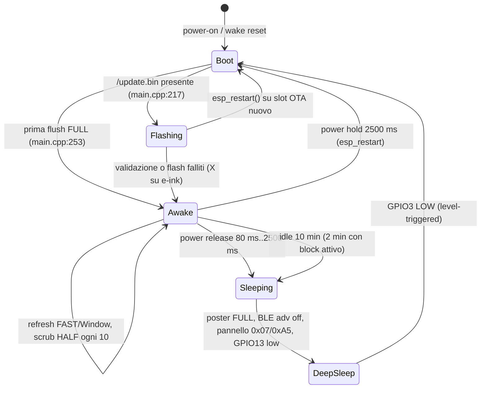

# Hardware, alimentazione, NVS e aggiornamento firmware

Ambito: `freeink-sdk/` (profili board, display, input, SD, batteria, sleep) e i moduli firmware `xphone-os/src/{Sleep,SdUpdate,BatteryGauge}.cpp` + `partitions.csv`. Scene e UI: [app e schermate](04-app-e-schermate.md). Motore EPUB e cache SD: [reader](05-reader-epub.md). Il firmware è **una sola immagine** per X3 e X4 (`flowe-os/xphone-os/platformio.ini:1-8`): entrambi i `BoardProfile` sono compilati e la scelta avviene a runtime.

## 1. Profili board: X3 e X4

`BoardProfile` è la struttura unica che descrive pinout/pannello/capacità (`flowe-os/freeink-sdk/libs/hardware/BoardConfig/include/BoardConfig.h:437-471`); il profilo attivo è `BoardConfig::ACTIVE`, inizializzato a `DEFAULT_DEVICE` = `XTEINK_X4` per la build C3 duale (`BoardConfig.h:873-899`) e sostituito da `selectDevice()` (`BoardConfig.h:903-968`).

| Voce | X3 (`XTEINK_X3`, BoardConfig.h:578-599) | X4 (`XTEINK_X4`, BoardConfig.h:551-571) |
|---|---|---|
| MCU | ESP32-C3 (`FREEINK_MCU_C3`, BoardConfig.h:66) | ESP32-C3 |
| Controller pannello | UC8253 | SSD1677 |
| Risoluzione nativa (landscape) | 792 × 528 → fb 99 B/riga × 528 = **52 272 B** | 800 × 480 → **48 000 B** |
| SPI display | `sclk=8 mosi=10 cs=21 dc=4 rst=5 busy=6`, powerEnable n/d | identici |
| Clock SPI display | `displaySpiHz=0` → default driver **16 MHz** (`Uc8253X3Driver.cpp:62-65`) | **5 MHz** dal profilo |
| Polarità BUSY | `X3TwoPhase` (fronte LOW poi ritorno HIGH), `Uc8253X3Driver.h:49` | `ActiveHigh`, `Ssd1677Driver.h:56` |
| SD | `miso=7`, `cs=12`, `sclk/mosi` non assegnati (bus condiviso col display), `spiHz=0` → **40 MHz** (`SDCardManager.cpp:40`) | identico |
| Pulsanti | ladder ADC su GPIO1 + GPIO2, power GPIO3 attivo-LOW | identici |
| Batteria | BQ27220 I²C `0x55` su `SDA=20 / SCL=0 @400 kHz`, nessun charger IC | ADC `GPIO0`, divisore ×2.0 |
| Latch alimentazione | MOSFET su **GPIO13**, tenuto basso nel sonno (`xphone-os/src/Sleep.cpp:399-404`) | stesso codice, eseguito comunque |
| Touch / frontlight / audio / LED | `NO_TOUCH`, `NO_FRONTLIGHT`, `NO_AUDIO`, `NO_LEDS` | idem |
| Sensori dichiarati nel profilo | default `sensors` a zero (`BoardConfig.h:464`) benché DS3231 e QMI8658 siano fisicamente presenti | nessuno |
| Orientamento pannello / `uiScale` | `NO_FLIP` (scansione nativa) / 1.0 | `NO_FLIP` / 1.0 |

Il campo `usbDetect` valorizzato a `20` in entrambi i profili non è letto da nessun modulo (unico riscontro: la dichiarazione `BoardConfig.h:451`).

### Ladder ADC dei pulsanti

Due pin ADC con divisori resistivi, attenuazione `ADC_11db`, pin in `INPUT` (`InputManager.cpp:71-80`). Selezione: bottone `i` se `ranges[i+1] < adc <= ranges[i]` (`InputManager.cpp:94-102`); soglie in `InputManager.cpp:28-29`, medie misurate su device reali in `InputManager.cpp:14-27`.

| Pin | Bottone (bit) | Intervallo ADC | Media misurata |
|---|---|---|---|
| GPIO1 | Back (0) | 3100 < adc ≤ 3900 | 3512 |
| GPIO1 | Confirm (1) | 2090 < adc ≤ 3100 | 2694 |
| GPIO1 | Left (2) | 750 < adc ≤ 2090 | 1493 |
| GPIO1 | Right (3) | adc ≤ 750 | 5 |
| GPIO2 | Up (4) | 1120 < adc ≤ 3900 | 2242 |
| GPIO2 | Down (5) | adc ≤ 1120 | 5 |
| GPIO3 | Power (6) | livello digitale LOW = premuto | — |

`ADC_NO_BUTTON = 3900`, `DEBOUNCE_DELAY = 5 ms` (`InputManager.h:191-192`). Il campionamento asincrono opzionale dell'SDK (`beginAsync`, default 15 ms / coda 32, `InputManager.h:112-126`) non è usato: il firmware ha il proprio task (vedi [architettura](02-architettura-firmware.md)).

## 2. Rilevamento device (`XteinkDetect`)

Fingerprint I²C sul bus secondario X3 (`SDA=20`, `SCL=0`, 400 kHz, `Wire.setTimeOut(6)`) — `XteinkDetect.cpp:11-25,106-115`. Ogni probe verifica **un valore plausibile**, non il solo ACK:

| Chip | Indirizzo | Registro | Criterio |
|---|---|---|---|
| BQ27220 (gauge) | `0x55` | `0x2C` SoC, `0x08` Voltage | `soc ≤ 100` **e** `2500 ≤ mV ≤ 5000` (`:52-58`) |
| DS3231 (RTC) | `0x68` | `0x00` secondi | BCD valido: decine ≤ 5, unità ≤ 9 (`:60-66`) |
| QMI8658 (IMU) | `0x6B`, fallback `0x6A` | `0x00` WHO_AM_I | `== 0x05` (`:68-73`) |

Prima dei probe c'è un **bus clear a nove impulsi** (NXP I2C 3.1.16): se `SDA` è basso si pulsa `SCL` fino a 9 volte a ~50 kHz e si genera uno STOP manuale (`:82-104`). Motivo esplicito nel codice: uno slave bloccato farebbe fallire tutti i probe e un X3 verrebbe classificato X4 → protocollo pannello sbagliato, device cieco. Il verdetto richiede **due passate consecutive con punteggio ≥ 2 su 3** (`:119-127`), così un singolo ACK spurio non ribalta il risultato; `selectXteinkDevice()` applica il profilo e restituisce l'esito (`:129-133`).

Nel firmware la chiamata è la prima cosa dopo la seriale, prima di SD e display (`xphone-os/src/main.cpp:166-170`): imposta `gDeviceIsX3` e chiama `display.setDisplayX3()`. La ragione dell'immagine universale è in `platformio.ini:6-8`: entrambi gli zip di release si chiamavano `update.bin` e l'immagine sbagliata inizializza il controller sbagliato (schermo congelato, pulsanti apparentemente morti).

## 3. Display: bus, framebuffer, refresh, LUT

**Framebuffer** — proprietà della facade `FreeInkDisplay`, statico in DRAM, dimensionato sul pannello più grande della build (`MAX_FRAMEBUFFER_BYTES`, `BoardConfig.h:864-871`); build a **buffer singolo** (`-DEINK_DISPLAY_SINGLE_BUFFER_MODE=1`, `platformio.ini:42`), quindi il frame precedente vive nella RAM del controller e non in un secondo buffer. Formato: 1 bpp, **MSB-first**, bit a 1 = bianco (`clearScreen(0xFF)`, `FreeInkDisplay.cpp:182`; maschere `0x80 >> (px & 7)` in `SdUpdate.cpp:64-84`). Le righe si inviano **dal basso verso l'alto** perché i gate sono invertiti (`EpdBus::sendPlaneFlipped`, `EpdBus.cpp:183-190`). La rotazione logica portrait 528×792 è software, in `Gfx::drawPixel` (`xphone-os/src/Gfx.h:17-22`), non nel pannello.

**Bus** (`EpdBus`): `SPISettings(spiHz, MSBFIRST, SPI_MODE0)` (`EpdBus.cpp:10`); reset = RST HIGH 20 ms, LOW 2 ms, HIGH 20 ms + settle extra (X3: **50 ms**, `Uc8253X3Driver.cpp:142`). `waitBusy` in modalità `X3TwoPhase`: attesa del fronte LOW con timeout **1000 ms**, poi attesa del ritorno HIGH con tetto **30 000 ms** (`EpdBus.cpp:147-161`); nessun errore propagato, solo `break`.

**Init controller UC8253** (`Uc8253X3Driver.cpp:97-139`): PSR `0x00`=`3F 0A`, risoluzione `0x61`=`03 18 02 58`, gate/source start `0x65`=`00 00 00 00`, power-off seq `0x03`=`20`, power setting `0x01`=`07 17 3F 3F 17`, VCOM_DC `0x82`=`24`, booster `0x06`=`25 25 3C 37`, PLL `0x30`=`09`, LV `0xE1`=`02`; poi **entrambi** i piani DTM1/DTM2 riempiti a `0xFF` (il UC8253 non ha l'auto-clear della RAM dell'SSD1677).

**Modalità di refresh.** API pubblica `FULL_REFRESH / HALF_REFRESH / FAST_REFRESH` (`FreeInkDisplay.h:31`), mappata su `RefreshMode::Full/Half/Fast` (`FreeInkDisplay.cpp:49-51`). Sul UC8253 (`Uc8253X3Driver.cpp:152-318`):

| Tier | Banco LUT | CDI (`0x50`) | Meccanica |
|---|---|---|---|
| FULL | `_full` (OEM) | `0x29 0x07` | DTM1 riempito bianco, DTM2 = nuovo frame; + eventuale passata di condizionamento con `_normal` (CDI `0xA9`) su finestra full-panel; + un settle FAST no-op perché "il primo differenziale dopo un full si sporca" (`:232-240`) |
| HALF | `_half` (scrub: WW==BW, WB==BB) | `0xA9 0x07` | pilota ogni pixel al target ignorando DTM1 |
| FAST | `_fast` (turbo) | `0x29 0x07` | differenziale puro contro DTM1 |
| Window | `_fast` via PTL `0x91`/`0x90`/`0x92` | `0x29 0x07` | X allineato a byte verso l'esterno, Y in **gate space** (`gate = H-1-y`), `:277-293` |
| Window flash | `_flash` (~8 frame) | `0x29 0x07` | feedback pressione sub-200 ms su regioni piccole (`Uc8253X3Driver.h:67-69`) |

Dopo ogni refresh il driver risincronizza DTM1 col frame mostrato (`:223-224`): è l'invariante richiesta dai differenziali successivi. `display()` con pannello spento promuove FAST → HALF (`:154-156`); i refresh non-FAST aggiungono `delay(200)` (`:199`); `begin()` forza **due full sync iniziali** (`_initialFullSyncsRemaining = 2`, `:144`) per condizionare le particelle. Una finestra parziale ricade sul FAST full-frame quando la RAM del controller non può supportare un differenziale pulito (piani grayscale caricati, resync pendente, pannello spento) — `:267-272`.

**Tempi**: nel codice non ci sono misure strumentate, solo valori dichiarati nei commenti del firmware — FAST ≈ **450 ms**, FULL ≈ **3,2 s** (`xphone-os/src/Scene.cpp:188-190`) — più il flash "sub-200 ms". `EpdBus::waitBusy` stampa la durata reale di ogni attesa se le si passa un tag (`EpdBus.cpp:163-165`): è il punto da strumentare in un fork.

**Ghosting / scrub**: politica nel firmware, non nel driver. Scrub HALF ogni `kScrubAfterRefreshes = 10` aggiornamenti differenziali (`xphone-os/src/Scene.h:99`, `Scene.cpp:196-199`), finestra parziale solo se il rect dirty è ≤ 50 % del pannello (`kPartialMaxAreaPct`, `Scene.cpp:149`), prime 2 flush dopo il boot in FULL (`kConditioningFlushes`, `Scene.cpp:154`). La schermata di sonno chiama `requestResync(1)` per forzare un full sync + una passata di condizionamento (`Sleep.cpp:125-132`).

**LUT**: sette banchi da 5 LUT (VCOM + WW/BW/WB/BB), array da 43 byte di cui il controller riceve **42** (`lutLen`, `Uc8253X3Driver.cpp:47`), in `src/lut/Uc8253X3Luts.h` (184 righe): `_normal`, `_half`, `_flash`, `_fast`, `_full`, `_gc` (grayscale 4 livelli), `_aa_pre_bw_mid` (precondizionamento grayscale OEM). Per sostituirle **non serve toccare il driver**: si definisce `const Uc8253X3Config& yourConfig();` in `namespace freeink` e si compila con `-DFREEINK_UC8253_X3_CONFIG=yourConfig` (`Uc8253X3Driver.cpp:524-532`).

**API utili al fork** (`FreeInkDisplay.h`): `setDisplayX3()`, `begin()`, `getFrameBuffer()`, `clearScreen(0xFF)`, `displayBuffer(mode, turnOffScreen)`, `displayWindow(x,y,w,h,turnOff)`, `displayWindowFlash(...)`, `requestResync(passes)`, `skipInitialResync()`, `deepSleep()`, `setCustomLUT(enabled, data)`, più il percorso grayscale a due piani (`displayGrayscaleBase` / `preconditionGrayscale` / `writeGrayscalePlaneStrip`).

## 4. Alimentazione, sleep, wake

Gesti del tasto power (`xphone-os/src/main.cpp:540-568`): **hold ≥ 2500 ms** → schermata "Restarting..." + `esp_restart()`, sparato *mentre* il tasto è ancora premuto; **press + release ≥ 80 ms** sotto la soglia hold → deep sleep sul fronte di rilascio; press < 80 ms → ignorato ("power blip"). Auto-sleep (`main.cpp:588-609`, costanti in `xphone-os/src/Sleep.h:23-34`):

| Condizione | Timeout | Nota |
|---|---|---|
| Normale | `XP_AUTO_SLEEP_MS` = **600 000 ms** (10 min) | 0 disabilita l'intero blocco (`#if` a compile-time) |
| Block attivo | `XP_AUTO_SLEEP_BLOCK_MS` = **120 000 ms** (2 min) | prima il block *teneva sveglio* il device; ora dorme prima, perché il blocco è imposto dall'iPhone |
| Scena `FileTransfer` | mai (deadline ripinnata ogni tick) | un upload multi-MB non produce pressioni tasti |

Il clock di idle si azzera su qualsiasi press edge o con power premuto; sottrazione unsigned rollover-safe (`main.cpp:592-603`).

Sequenza di `Sleep::sleepNow()` (`xphone-os/src/Sleep.cpp:198-423`), nell'ordine:

1. `WorkoutScene::flushPendingSend()`, `SCENES.waitFlushIdle()`, `input.suspendTask()` (`:202-204`).
2. **Snapshot NVS** (tabella §5): scena corrente, snapshot Block, card Today/Priorities/Workout, notifiche + tombstone (`:213-308`).
3. Refresh best-effort di priorities e today via BLE, **tetto 3500 ms ciascuno**, con break anticipato sul cambio di `revision()` e `processPending()` pompato a mano ogni 25 ms (`:327-350`).
4. **Poster di sonno** (`drawSleepScreen`, `:94-133`): lista priorities/workout dormiente, oppure wordmark "xphone" + rule 56×2 px, footer calendario/block e hint "press power to wake"; `requestResync(1)` + `flush(FULL_REFRESH)`.
5. `COMPANION_BLE.stopAdvertising()` — nessun deinit dello stack: ci pensa il reset di wake, i bond restano in NVS (`:361-363`).
6. Solo X3: `imuSleep()` — QMI8658 su `0x6B`/`0x6A`, `CTRL7=0x00`, `CTRL1=0x61` (`:146-193, 366`).
7. `gfx.display().deepSleep()` → UC8253: POWER_OFF poi `0x07` + `0xA5` (`Uc8253X3Driver.cpp:514-522`); SSD1677 usa `0x10` (`Ssd1677Driver.cpp:37,485-495`). L'e-ink trattiene l'immagine a ~0 corrente.
8. Attesa del **rilascio completo** del tasto (stato debounced, poi livello raw del pin): il wake GPIO del C3 è *level-triggered* LOW, un pin ancora basso risveglierebbe subito (`:373-385`).
9. `Serial.flush()` + `Serial.end()` (teardown USB CDC, `:388-392`).
10. GPIO13 (latch batteria) forzato a 0, `esp_sleep_config_gpio_isolate()`, `gpio_deep_sleep_hold_en()`, `gpio_hold_en(13)` (`:399-404`).
11. `esp_deep_sleep_enable_gpio_wakeup(1 << GPIO3, ESP_GPIO_WAKEUP_GPIO_LOW)`; se fallisce → `esp_restart()` invece di dormire non risvegliabile su USB (`:412-418`); poi `esp_deep_sleep_start()`.

Il wake **non è un resume**: è un reset completo (su X3 il tasto power provoca un power-on reset che azzera l'intero dominio RTC — per questo la persistenza è su NVS e non in RTC memory, `Sleep.cpp:36-43`). Il boot ripercorre `boot()` (`main.cpp:146-319`): detect → SPI → display → splash → **self-update SD** → input → `seedPersistedBlock()` → `consumeRestoreScene()` (chiave letta **e rimossa**) → `showSceneById()` / `showLauncher()` → prima flush FULL → gauge → BLE/ANCS → CPU a `XP_CPU_MHZ`. `esp_reset_reason()` è catturato per primo e mostrato in About (`main.cpp:127-150`). L'SDK offre anche `freeink::PowerManager` (`PowerManager.cpp:14-71`) con la stessa logica in forma portabile (ext1 su Xtensa, gpio wakeup su RISC-V), ma **non è linkato**: il firmware replica la sequenza a mano.

## 5. Persistenza: NVS e file su SD

Tutto il firmware usa **un solo namespace NVS: `"xphone"`** (Arduino `Preferences` sopra la partizione `nvs` da 20 KB). Nomi chiave ≤ 15 caratteri per il limite ESP-IDF.

| Chiave | Tipo | Significato | Scrive | Legge |
|---|---|---|---|---|
| `lastScene` | `uint32` | scena su vetro al momento del sonno | `Sleep.cpp:216` | `Sleep.cpp:425-436` (consume-once: legge e **rimuove**) |
| `blkActive` | `bool` | sessione Block attiva | `Sleep.cpp:225`, rimossa a `:232` | `Sleep.cpp:443` |
| `blkBreak` | `bool` | Block in pausa | `Sleep.cpp:226` | `Sleep.cpp:444` |
| `blkRemain` | `int` | minuti residui | `Sleep.cpp:227` | `Sleep.cpp:445` |
| `blkDur` | `int` | durata totale in minuti | `Sleep.cpp:228` | `Sleep.cpp:446` |
| `blkPreset` | `string` | nome preset | `Sleep.cpp:229` | `Sleep.cpp:449` |
| `blkEnds` | `string` | label ora di fine ("until 10:30 AM") | `Sleep.cpp:230` | `Sleep.cpp:450` |
| `blkToday` | `int` | block completati oggi | `Sleep.cpp:240` (sempre) | `Sleep.cpp:457` |
| `blkStreak` | `int` | streak | `Sleep.cpp:241` | `Sleep.cpp:457` |
| `blkTotal` | `int` | totale storico | `Sleep.cpp:242` | `Sleep.cpp:458` |
| `todayCard` | `string` | ultimo JSON `today` ricevuto dal telefono | `Sleep.cpp:247` | `Sleep.cpp:462` |
| `prioCard` | `string` | JSON `priorities.snapshot` **riserializzato dallo store** | `Sleep.cpp:251-267` | `Sleep.cpp:464` |
| `wkCard` | `string` | JSON `workout.snapshot` dallo store | `Sleep.cpp:273-289` | `Sleep.cpp:466` |
| `notifStore` | `bytes` | blob `NotificationStore::Entry`, max **10** voci (~2,2 KB) | `Sleep.cpp:294-296` | `Sleep.cpp:472` |
| `notifTombs` | `bytes` | tombstone delle notifiche cancellate | `Sleep.cpp:300-302` | `Sleep.cpp:487` |
| `notifBlkList` | `bytes` | blocklist per bundle id, struct versionata (`schemaVersion=1`) | `NotificationFilter.cpp:123-126` | `NotificationFilter.cpp:51-58` |
| `rdBook` | `string` | path dell'ultimo EPUB aperto | `ReaderScene.cpp:766`, rimossa `:351` se l'apertura fallisce | `ReaderScene.cpp:199` |
| `rdFont` | `uint8` | `fontId` del reader (0/1/2) | `ReaderScene.cpp:660` | `ReaderScene.cpp:200` |
| `iconPack` | `uint8` | indice icon pack del launcher | `IconStyle.cpp:48` | `IconStyle.cpp:24` |
| `wifiSsid` | `string` | SSID per il File Transfer (in chiaro) | `WifiCreds.cpp:35`, rimossa `:32` | `WifiCreds.cpp:22` |
| `wifiPass` | `string` | password Wi-Fi (in chiaro; motivazione in `WifiCreds.h:6-10`) | `WifiCreds.cpp:36` | `WifiCreds.cpp:23` |

I bond BLE stanno nella stessa partizione `nvs`, gestita da NimBLE (nessuna chiave `Preferences`).

| File su SD | Uso |
|---|---|
| `/update.bin` | immagine da flashare al boot; rinominata dopo l'uso (`SdUpdate.cpp:33`) |
| `/update.bin.flashed` | immagine consumata, riflashabile dal picker Settings (`SdUpdate.cpp:34`, `SettingsScene.cpp:74-84`) |
| `/boot-trace.txt` | breadcrumb di boot; **si attiva solo se il file esiste già**, altrimenti zero scritture (`main.cpp:110-125,186-191`) |
| `/books` | libreria EPUB/TXT scansionata da reader e File Transfer (`ReaderScene.cpp:686`, `FileTransferServer.cpp:119`) |
| `/.xphone/epub_<hash>/{book.bin, progress.bin, sections/<spine>.bin}` | cache reader; `<hash>` = `std::hash<std::string>` del path (`reader/ReaderSettings.h:6-9`, `reader/Epub.h:39-43`). Dettagli: [reader](05-reader-epub.md) |

## 6. Aggiornamento firmware

`xphone-os/partitions.csv` (flash 16 MB, `platformio.ini:21-27`, offset upload `0x10000`):

| Nome | Tipo/Sottotipo | Offset | Dimensione |
|---|---|---|---|
| `nvs` | data/nvs | `0x9000` | `0x5000` (20 KB) |
| `otadata` | data/ota | `0xE000` | `0x2000` (8 KB, 2 slot da 4 KB) |
| `app0` | app/ota_0 | `0x10000` | `0x640000` (6,5 MB) |
| `app1` | app/ota_1 | `0x650000` | `0x640000` (6,5 MB) |
| `spiffs` | data/spiffs | `0xC90000` | `0x360000` (3,375 MB) — **nessun mount nel firmware** |
| `coredump` | data/coredump | `0xFF0000` | `0x10000` — nessun uso esplicito nel codice |

Flusso `sd_update::checkAndApply()` (`SdUpdate.cpp:545-559`), invocato allo stadio 2.5 del boot, *prima* di input e radio, così una build guasta è sempre sostituibile:

1. `SdMan.begin()`; se non monta → boot normale. `SdMan.exists("/update.bin")`; se assente → boot normale.
2. Alloca **4096 B** di buffer chunk sull'heap con guard RAII (mai in BSS: 99,9 % dei boot non lo tocca) — `:463-474`.
3. `esp_ota_get_next_update_partition()` = slot OTA **inattivo**; log di running/dest (`:483-493`).
4. **Validazione** (`validateImage`, `:178-291`), interamente prima di qualunque scrittura:
   - `fileSize ≥ 64 KiB` e `≤ dimensione partizione`;
   - header 24 B: `header[0] == 0xE9` (magic), `segCount = header[1]`, `hashAppended = header[23] != 0`;
   - per ogni segmento: header 8 B entro EOF, `dataLen` (offset 4 dell'header) entro EOF, dati letti a chunk di 4 KB;
   - checksum XOR ESP con seed `0xEF` su tutti i byte dei segmenti, confrontato con l'ultimo byte del padding allineato a 16 (`padEnd = (pos+16) & ~15`);
   - **dimensione esatta**: `padEnd + (hashAppended ? 32 : 0) == fileSize`;
   - SHA-256 su header + segment header + dati + padding, confrontato col trailer di 32 B.
5. Barra di progresso e-ink: una FULL per la cornice (larghezza `dw-160`, altezza 48, bordo 4 px), poi una FAST ogni **25 %** (5 refresh totali) — `:91-131`.
6. **Flash** (`flashImage`, `:390-431`): `esp_partition_erase_range` interleaved a blocchi di 64 KiB (arrotondati a 4 KiB) + `esp_partition_write` a chunk di 4096 B, `delay(1)` per il watchdog, log ogni 10 %.
7. **Retire del file prima** dello switch di boot: `remove("/update.bin.flashed")`, poi `rename("/update.bin", "/update.bin.flashed")` con fallback su `remove`. Se non riesce nessuno dei due → **si rifiuta di cambiare partizione di boot**, altrimenti ogni boot riflasherebbe (`:439-449, 520-523`).
8. **Switch otadata raw** (`otadataSwitchTo`, `:318-382`): legge i due `SelectEntry` da 32 B (offset 0 e 4096), sceglie l'attivo (CRC valido, `ota_seq` massima, stato non `INVALID(3)`/`ABORTED(4)`), calcola la minima `newSeq > activeSeq` con `(newSeq-1) % 2 == destOtaIdx`, e scrive `{seq, label 0xFF…, state = OTA_IMG_NEW(0), crc = crc32_le(UINT32_MAX, seq)}` nello slot **opposto** dopo averlo cancellato. Non usa `esp_ota_set_boot_partition` perché il suo `esp_image_verify` rifiuta le immagini patchate dal bootloader di fabbrica Xteink con errori efuse-blk-rev spurii (`SdUpdate.h:14-18`, `SdUpdate.cpp:293-299`).
9. `esp_restart()` dopo `Serial.flush()` + `delay(250)`.

**Errori e garanzie anti-brick**: ogni fallimento disegna una X diagonale a tutto schermo (FULL + `delay(2500)`, `:136-153`) e **ritorna**, lasciando la selezione di boot invariata — il firmware corrente resta al comando. Lo slot in esecuzione non viene mai scritto (si scrive solo `get_next_update_partition`). Non esiste invece nessun `esp_ota_mark_app_valid` / rollback automatico (grep su `xphone-os/src`: zero riscontri). Lo stesso percorso è riusabile a runtime dalla scena Settings via `sd_update::flashFromPath()` (`SdUpdate.cpp:561-568`) su un `*.bin` o `*.bin.flashed` scelto dal picker (`SettingsScene.cpp:74-84,180-182`).

**Combinazione tasti e `RecoveryBoot`.** L'SDK contiene `freeink::recovery::checkBootCombo()` (`RecoveryBoot.cpp:123-139`): col combo premuto scrive otadata verso `ota_0` (dove vive il firmware di recovery, cioè CrossPoint all'offset di upload `0x10000`) e riavvia, previa verifica che il primo byte dello slot sia `0xE9` (`hasApp`, `:67-71`) e che non si stia già eseguendo quello slot. Il combo reale è **Back + Up**, non Left+Power (`:29-42, 16-21`): sono gli unici due tasti su ladder ADC diversi, quindi l'unica coppia leggibile contemporaneamente; conferma dopo 5 campioni consecutivi su massimo 16, passo 6 ms. **Questo modulo non è compilato né chiamato dal firmware**: non è in `lib_deps` (`platformio.ini:83-90`) e non compare in `xphone-os/src` — oggi il rollback verso CrossPoint richiede il picker Settings o un flash via USB.

## 7. Batteria

Percorso SDK (`BatteryMonitor.cpp`): la scelta gauge-vs-ADC è **runtime** sul profilo attivo (`ACTIVE.batteryGauge.gaugeAddr != 0`), condizione necessaria perché X3 e X4 condividano un binario (`BoardConfig.h:153-159`). Registri BQ27220 letti: `0x2C` SoC (u16 LE, clamp a 100) e `0x08` Voltage in mV senza divisore (`BatteryMonitor.cpp:22-23,113-130,202-208`); `Wire` è aperto una volta sola (`ensureWire`, `:36-41`). Nessun filtro, nessuna media, nessuna isteresi: la percentuale mostrata è il registro grezzo. Il fallback **`--%`** nasce da `readPercentageChecked()` che ritorna `false` quando la transazione I²C fallisce (`:132-139`); `LauncherScene` passa `-1` a `StatusBar::drawBattery`, che disegna `"--%"` e l'icona vuota (`LauncherScene.cpp:181-186`, `StatusBar.h:36,55,81-85`). Sul percorso ADC (X4) la percentuale viene da un polinomio cubico sui volt, clampato 0..100 (`BatteryMonitor.cpp:297-310`).

`isCharging()` sul gauge richiede un charger IC (BQ25896 `REG0B` bit [4:3]); **l'X3 non ne ha** (`chargerAddr = 0`), quindi ritorna sempre `false` (`BatteryMonitor.cpp:234-246`). Il firmware aggira il problema leggendo `AverageCurrent` `0x14` (mA signed) e considerando "in carica" `avgMa > 0` (`xphone-os/src/BatteryGauge.h:26`, `LauncherScene.cpp:183-184`).

`xphone-os/src/BatteryGauge.cpp` aggiunge ciò che l'SDK non copre:

- letture dirette `0x10` RemainingCapacity, `0x12` FullChargeCapacity, `0x14` AverageCurrent, `0x3C` DesignCapacity (`BatteryGauge.h:23-28`), usate dalla scena About (`AboutScene.cpp:117-144`);
- `ensureDesignCapacity()` (`:184-256`), eseguito a ogni boot dopo la prima flush e prima del BLE (`main.cpp:265-271`): il gauge esce di fabbrica a **3000 mAh** mentre il pacco reale è ~**650 mAh** (`XP_BATT_DESIGN_MAH`, default 650, override `-DXP_BATT_DESIGN_MAH=`), quindi il SoC saturava intorno al 21-22 %. Sequenza verificata contro il driver Flipper Zero: unseal `0x0414`/`0x3672` su `0x00` (solo se SEC = `0b11`), `ENTER_CFG_UPDATE 0x0090` via MAC `0x3E`, poll di `OperationStatus 0x3A` bit 10 (timeout 1000 ms), scrittura DM `0x929F` (indirizzo LE + valore MSB-first), checksum `0xFF - sum` su `0x60` e lunghezza 6 su `0x61`, verifica in rilettura da `0x40`, `EXIT_CFG_UPDATE_REINIT 0x0091` con poll di uscita (timeout 2500 ms) e conferma fino a 30 × 50 ms. Il gauge resta **deliberatamente unsealed**; la configurazione vive in RAM battery-backed, quindi un distacco della batteria la riporta a 3000 mAh e il boot successivo la riprogramma.

## 8. Moduli SDK non usati sull'X3

Non presenti in `lib_deps` (`platformio.ini:83-90`), quindi nemmeno compilati: `AudioManager` (I²S/codec), `Microphone` (PDM), `Buzzer` (tono LEDC su `audio.buzzer`, non assegnato sui profili Xteink), `LedManager` (WS2812, `FREEINK_CAP_LED` solo M5), `FrontlightManager` (PWM, capacità off su X3/X4), `Rtc` (**solo PCF8563**, `Rtc/include/Rtc.h:3` — non parla col DS3231 dell'X3), `EnvironmentSensor` (SHT40), `Imu` (LSM6DS3TR-C; il QMI8658 dell'X3 è gestito a mano in `Sleep.cpp:146-193`), `PowerManager`, `RecoveryBoot`, `BoardT5S3`, `M5Pm1`, e i driver pannello `Ssd1677`/`Ed2208M5`/`Uc8253Murphy`/`It8951`/`LgfxEpd` diversi da UC8253-X3 (SSD1677 resta comunque linkato: serve all'X4 nello stesso binario).

## Cose da sistemare / attriti

1. **Il DS3231 dell'X3 esiste ma nessuno lo usa.** Il fingerprint lo interroga come prova di identità (`XteinkDetect.cpp:60-66`), ma il profilo `XTEINK_X3` lascia `sensors` al default tutto-zero (`BoardConfig.h:464`, nessun override in `:578-599`) e il firmware ripete "no RTC on X3/X4" per giustificare l'assenza di orologio e del timestamp "synced Xm ago" (`Sleep.cpp:88-91`, `Sleep.h:5-6`). Gravità **alta** per un fork (sblocca clock, sveglia temporizzata, countdown Block reali). Fix: scrivere un driver DS3231 (`Rtc` parla solo PCF8563, `Rtc.h:3`) e valorizzare `sensors = {20, 0, 400000, 0x68, 0, 0}` nel profilo X3.
2. **Nessun rollback automatico dopo l'OTA.** Non esiste `esp_ota_mark_app_valid` né `ota_state = PENDING_VERIFY` (unico stato scritto: `OTA_IMG_NEW`, `SdUpdate.cpp:365`). Un'immagine che supera la validazione ma non funziona è irrecuperabile senza USB. Gravità **alta**. Fix: scrivere `PENDING_VERIFY` e promuoverla a valida al primo boot completato.
3. **`RecoveryBoot` è codice morto e il combo è diverso da quello raccontato.** Il modulo non è in `lib_deps` (`platformio.ini:83-90`) e non è mai chiamato; il combo è Back+Up (`RecoveryBoot.cpp:36`), non Left+Power. Gravità **media**. Fix: aggiungere la libreria e chiamare `checkBootCombo()` come prima riga di `boot()`, oppure eliminare il modulo dal fork.
4. **La risoluzione UC8253 è hardcoded nell'init.** Il commento a `Uc8253X3Driver.cpp:52-54` promette che la geometria arriva dal `BoardProfile`, ma `initController` scrive `0x61` = `03 18 02 58` (792 × 600) come letterali (`:101-105`), incoerente sia col profilo (528 righe) sia con la promessa. Gravità **media**: un fork con pannello UC8253 di taglia diversa lo pilota parzialmente. Fix: derivare i 4 byte da `_w`/`_h` o da un campo del config.
5. **I campi `input.back/confirm/left/right/up/down` del profilo Xteink collidono con i pin del display.** Il profilo dichiara `up=4, down=5` (`BoardConfig.h:588`) che sono DC e RST del pannello (`BoardConfig.h:585`); sono innocui solo perché `XteinkAdcLadder` li ignora (`InputManager.cpp:72-80`). Gravità **media**: passare a `DigitalButtons` in un fork imposta `INPUT_PULLUP` sui pin del pannello. Fix: `PIN_UNASSIGNED` su tutti e sei, lasciando solo `power`.
6. **Configurazione morta che collide col bus I²C**: `usbDetect = 20` non è letto da nessuno (unico riscontro `BoardConfig.h:451`) e GPIO20 è SDA del gauge (`BoardConfig.h:599`); `batteryAdc = 0` (`BoardConfig.h:589`) rende `hasAdcBackend()` vero anche sull'X3 (`BatteryMonitor.cpp:97-99`), dove GPIO0 è SCL del gauge — innocuo solo perché il ramo gauge precede sempre. Gravità **bassa**. Fix: `PIN_UNASSIGNED` su entrambi i campi nel profilo X3.
7. **Percentuale batteria senza filtro né isteresi.** `readPercentageChecked` restituisce il registro grezzo (`BatteryMonitor.cpp:132-139`) e l'icona si ridisegna a ogni repaint: su e-ink un SoC che oscilla di 1 % costa refresh differenziali inutili. Gravità **bassa**. Fix: cache con soglia (aggiornare solo su Δ ≥ 2 % o dopo N secondi).
8. **Scrittura NVS pesante a ogni sonno su una partizione da 20 KB.** Ogni `sleepNow()` scrive fino a ~2,2 KB di notifiche più tre JSON di card e nove chiavi Block (`Sleep.cpp:213-308`) nella partizione `nvs` di `0x5000` byte (`partitions.csv:2`), senza controllare il valore di ritorno di `putBytes`/`putString`: un `NOT_ENOUGH_SPACE` è silenzioso e il ciclo di write è alto. Gravità **media**. Fix: verificare i ritorni e spostare snapshot/card su SD, o allargare `nvs`.
9. **Timeout BUSY che degradano in silenzio.** `waitBusy` esce con `break` dopo 30 s (e dopo 1 s se il fronte LOW non arriva) senza segnalare nulla al chiamante (`EpdBus.cpp:122-161`), e `PanelDriver::display` non ha valore di ritorno: un pannello che non risponde produce una UI che "sembra" aggiornata — esattamente il sintomo del bug di campo che ha richiesto `/boot-trace.txt` (`main.cpp:110-114`). Gravità **media**. Fix: far restituire un `bool` a `waitBusy` e propagarlo fino a una diagnostica visibile.
10. **`writeMirroredPlane`/`fillPlane` troncano silenziosamente a 128 byte per riga** (`EpdBus.cpp:169-171,193-194`): X3 (99 B) e X4 (100 B) rientrano, ma in un fork un pannello ≥ 1024 px di larghezza perde metà riga senza errori. Gravità **bassa**. Fix: scrivere a blocchi con `rawWriteBytes` invece del buffer di riga fisso, o mettere un `static_assert`/controllo esplicito.
11. **Tre env PlatformIO identici che divergono in un flag ridondante**: `-DFREEINK_BATTERY_I2C_GAUGE=1` è solo in `[env:x3]` (`platformio.ini:103`) mentre `xteink` e `x4` producono la stessa immagine e funzionano perché il default derivato da `FREEINK_DEVICE_X3` vale già 1 (`BoardConfig.h:158-159`). Gravità **bassa**. Fix: un solo env reale più alias, senza duplicare i flag.
12. **Il FULL costa una passata extra "no-op"**: il driver esegue un FAST aggiuntivo dello stesso frame perché "il primo differenziale dopo un full si sporca" (`Uc8253X3Driver.cpp:232-240`), sommato al `delay(200)` di `:199` e alle due full di condizionamento al boot (`:144`); è la voce principale dei ~3,2 s dichiarati (`Scene.cpp:188-190`). Gravità **bassa** (workaround funzionante, costo noto). Fix: strumentare `waitBusy` con i tag già previsti e verificare se una LUT `_full` corretta rende superflua la passata extra.
13. **Le partizioni `spiffs` (3,375 MB) e `coredump` sono dichiarate ma inutilizzate**: nessun mount SPIFFS/LittleFS né chiamata core-dump in `xphone-os` (grep: zero riscontri), mentre gli slot app sono già stretti al punto di richiedere `-flto` (`platformio.ini:63`). Gravità **bassa**. Fix: recuperare lo spazio per gli slot OTA, o usare `coredump` per la diagnostica post-crash al posto di `/boot-trace.txt`.
